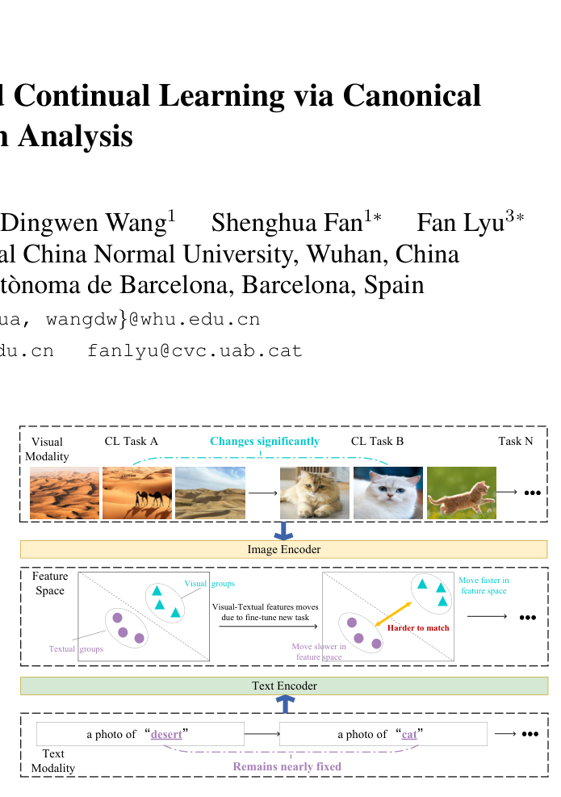
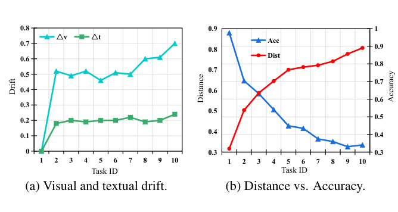

# Subspace Alignment for CLIP-based Continual Learning via Canonical Correlation Analysis

## 📌 기본 정보
* **저자:** Huan Zhang, Shuyu Dong, Yujin Zheng, Dingwen Wang, Shenghua Fan*, Fan Lyu*
* **학회/저널:** CVPR 2025 (IEEE/CVF Conference on Computer Vision and Pattern Recognition)
* **발표 연도 (Year):** 2026
* **논문 링크 (Link):** [GitHub Repository](https://github.com/zhwhu/CCA-CL)
* **핵심 키워드 (Keywords):** Continual Learning (지속 학습), Vision-Language Models (CLIP), Canonical Correlation Analysis (CCA, 정전정분석), Asymmetric Drift (비대칭 표류), Subspace Alignment (부공간 정렬), Random Fourier Projection (RFP), Exemplar-Free CL

### Abstract & Introduction
1. Asymmetric Drift
- CLIP 기반의 지속학습 환경에서 이미지 데이터는 task가 바뀔 때마다 이미지 자체의 변화가 커저 visual encoder가 크게 업데이트 된다.
- 반면 text prompt는 텍스트 분포의 다양성이 낮아 텍스트 인코더가 상대적으로 거의 업데이트 되지 않는다.
- 두 인코더 간에 업데이트 불균형이 발생하며, 시간이 흐를수록 특정 공간에서 이미지와 텍스트 특징의 거리가 멀어져 매칭 정확도가 하락하는 비대칭 드리프트(Asymmetric Drift) 문제가 발생한다.

2. 동결된 CLIP을 활용하는 통계적 해결책: CCA-CL
- 모달리티 거리를 좁히기 위해 CLIP 자체의 파라미터를 미세조정하면 기존 사전 학습 지식이 망가지거나 망각 현상이 일어나기 쉽다
- 이를 피하기 위해 저자들은 CLIP은 고정한 채 task를 거치면서 시각-text의 공분산 통계 데이터를 누적하고 정형상관분석(CCA) 수학 공식을 풀어 두 모달리티의 상관관계를 극대화하는 공유 서브스페이스를 도출하였다.
- 이 공유공간 내에 이미지와 텍스트 특징을 투영시킴으로써 모달리티 모달리티 사이의 거리를 최소화하고 정렬 상태를 보완한다.

3. 무작위 푸리에 투영(RFP)을 통한 비선형 관계 포착
- 고전적인 선형 CCA 방식은 데이터 내 복잡한 비선형적 관계를 반영하는 데 한계가 있었따.
- 추가 학습 파라미터가 없으면서도 무작위 커널 근사를 지원하는 RFP 기법을 CCA 전단계에 결합하여 특징을 고차원으로 맵핑함으로써 비선형적 상관관계까지 정렬할 수 있도록 표현력을 극대화하였다.

### Related Work
#### Continual Learning on CLIP
* 기존 CLIP 기반 지속 학습 연구의 세 가지 접근법
    * CLIP 동결 + 추가 모듈 학습 : CLIP 자체는 건드리지 않고 출력 특징을 변환하는 가벼운 모듈(PROOF)이나 텍스트 지식을 주입하는 선형 유닛(ENGINE)을 추가로 붙여 학습한다.
    * CLIP 미세조정 및 PEFT : 백본을 최대한 보존하면서 모델 머징 기술을 사용하거나 task 마다 개별 LoRA 모듈을 학습하는 방식으로 CLIP 자체를 미세하게 update
    * 모달리티 불일치 해결 관점 : 이미지와 텍스트 간의 모달리티 갭을 안정적으로 유지하면서 적응력을 높이거나 모달 관계를 기하학적 관점에서 분석하려는 시도.
* 본 논문(CCA-CL) : 기존 연구들은 단순히 파라미터를 효율적으로 학습하는 데만 집중하였으나, 본 연구는 이미지와 텍스트 인코더가 서로 다른 속도로 업데이트 되며 발생하는 비대칭 드리프트 문제를 거리 기반의 기하학적 관점에서 최초로 정의하고 이를 해결하기 위해 정형상관분석(CCA)을 도입했다는 점에서 차별화된다.

#### Canonical Correlation Analysis
* CCA : 두 종류의 변수 집합(예: 이미지 특징과 텍스트 특징) 간의 상관관계를 극대화하는 최적의 선형 투영 방향을 찾아내는 방법이다.

* 현대적 확장과 응용 : 딥러닝과 결합한 Deep CCA, 비선형 관계를 푸는 Kernel CCA 등으로 발전. 텍스트-오디오-비디오 다중 모달 표현 정렬이나 감정 인식 등에 널리 활용되고 있다

### Preliminaries

#### Problem Definition (문제 정의)
* **클래스 증분 학습 (Class-Incremental Learning, CIL)**
  * 모델은 순차적으로 들어오는 일련의 태스크 $T = \{D_1, \dots, D_T\}$를 학습하며, 각 태스크 $t$의 범주(Class)들은 서로 중복되지 않는 서로소 집합입니다 ($C_i \cap C_j = \emptyset, i \neq j$).
* **CLIP의 제로샷 분류 메커니즘**
  * 이미지 $x$ 입력 시 Visual Encoder를 통해 이미지 특징 벡터 $z_x = F_v(x)$를 추출합니다.
  * 클래스 $c$에 대한 텍스트 프로토타입 벡터 $z_y^{(c)} = F_t(\text{"a photo of [CLS]"})$를 Text Encoder를 통해 생성합니다.
  * 이미지 특징 $z_x$와 텍스트 프로토타입 $z_y^{(c)}$ 간의 **코사인 유사도(Cosine Similarity)**를 계산하여 가장 높은 유사도를 가진 클래스로 예측합니다:
    $$\hat{y} = \arg\max_{c \in C_1 \cup \dots \cup C_t} \text{sim}(z_x, z_y^{(c)}), \quad \text{sim}(z_x, z_y^{(c)}) = \frac{z_x^\top z_y^{(c)}}{\|z_x\|_2 \|z_y^{(c)}\|_2}$$
* **문제의 직관적 원인**
  * 새로운 태스크 학습 시 이미지 데이터(시각 분포)는 끊임없이 변하지만, 텍스트 프롬프트는 고정되어 있습니다. 이로 인해 Visual Encoder와 Text Encoder 간 **비대칭적 업데이트(Asymmetric Updates)**가 발생하여 모달리티 간 거리가 벌어집니다.

#### Preliminaries on CCA (정형상관분석 기초)
* **기본 목표**
  * 이미지 특징 집합 $X$와 텍스트 특징 집합 $Y$가 주어졌을 때, 두 특징을 각각 투영 행렬 $A, B$를 통해 특정 공간으로 투영시켜 $A^\top X$와 $B^\top Y$ 사이의 상관관계(Correlation)를 극대화합니다:
    $$\max_{A, B} \text{corr}(A^\top X, B^\top Y) = \frac{A^\top \Sigma_{XY} B}{\sqrt{A^\top \Sigma_{XX} A} \sqrt{B^\top \Sigma_{YY} B}}$$
* **수학적 해결 과정**
  1. 두 모달리티 각각의 공분산 행렬 $\Sigma_{XX}, \Sigma_{YY}$와 이들 간의 교차 공분산 행렬 $\Sigma_{XY}$를 정의합니다.
  2. 백화(Whitening) 과정을 거쳐 Whitened Cross-Covariance Matrix $K$에 대해 고유값 분해(Eigenvalue Decomposition)를 수행합니다:
     $$K = \Sigma_{XX}^{-1/2} \Sigma_{XY} \Sigma_{YY}^{-1/2} = V \Lambda U^\top$$
     * $\Lambda$: 대각 성분이 클수록 두 모달리티가 해당 축을 따라 더 강력한 선형적 의존성(정렬 관계)을 가짐을 의미합니다.
     * $V, U$: 모달리티 $X, Y$ 각각에서 정렬이 가장 잘 이루어지는 서브스페이스의 방향(Canonical Directions)입니다.
  3. **최종 CCA 투영 행렬 $A, B$ 도출**:
     $$A = \Sigma_{XX}^{-1/2} V, \quad B = \Sigma_{YY}^{-1/2} U$$
  4. 이 행렬을 적용하면($z_x^{\text{cca}} = A^\top z_x, z_y^{\text{cca}} = B^\top z_y$), 두 모달리티의 특징들이 상관관계가 극대화되는 **공유 서브스페이스(Shared Subspace)**로 투영되게 됩니다.

### Quantification of Asymmetric Drift (비대칭 드리프트 정량화 및 관찰)
* **비대칭 드리프트 측정 3가지 수학적 지표**
  1. **시각적 드리프트 (Visual Drift, $\Delta_v$)**
     $$\Delta_v = \left\| \mathbb{E}_{x \in \mathcal{D}_t} [z_x] - \mathbb{E}_{x \in \mathcal{D}_{t-1}} [z_x] \right\|_2$$
     * 연속된 두 태스크 $t-1$과 $t$ 간의 평균 이미지 특징 벡터 변동량($L_2$ norm)으로, Visual Encoder의 변화 크기를 정량화합니다.

  2. **텍스트 드리프트 (Textual Drift, $\Delta_t$)**
     $$\Delta_t = \left\| \mathbb{E}_{y \in \mathcal{D}_t} [z_y] - \mathbb{E}_{y \in \mathcal{D}_{t-1}} [z_y] \right\|_2$$
     * 연속된 두 태스크 간의 평균 텍스트 특징 벡터 변동량을 측정합니다.

  3. **시각-텍스트 특징 거리 (Visual-Textual Feature Distance, $\text{dist}(t)$)**
     $$\text{dist}(t) = \mathbb{E}_{(x,y) \in \mathcal{D}_t} \left[ \left\| z_x^{(t)} - z_y^{(t)} \right\|_2 \right]$$
     * 태스크 $t$의 이미지-텍스트 쌍 특징 벡터 간 평균 $L_2$ 거리로, 모달리티 간 정렬 불일치(Misalignment) 수치를 나타냅니다.

* **실험적 관찰 결과 (Figure 3 Findings)**
  1. **시각 변동성의 압도적 우위 ($\Delta_v \gg \Delta_t$)**
     $$\Delta_v \gg \Delta_t \quad (\forall t)$$
     * 모든 태스크 구간에서 Visual Drift($\Delta_v$)가 Textual Drift($\Delta_t$)를 압도합니다. 새로운 이미지 분포 수용 시 Visual Encoder는 크게 변화하는 반면 Text Encoder는 정적인 상태를 유지하기 때문입니다.

  2. **특징 거리 증대와 분류 정확도의 상관관계**
     $$\text{dist}(t) \uparrow \; \implies \; \text{Accuracy}(t) \downarrow$$
     * 한쪽 인코더의 급격한 이동으로 인해 cross-modal 거리 $\text{dist}(t)$가 태스크 진행에 따라 단조 증가(Monotonic Increase)하며, 거리 확장에 완벽히 비례하여 제로샷 분류 정확도가 지속해서 하락합니다.

---

### 🛠️ Methodology: Subspace Alignment via CCA (CCA-CL)

#### 1. Exemplar-Free Covariance Matrix Accumulation (공분산 행렬의 실시간 누적)
* **메모리 버퍼 없는 통계적 기억 (Statistical Memory)**
  * 과거 원본 이미지를 별도의 메모리 버퍼(Exemplar Buffer)에 저장하지 않고, 각 미니배치별 특징 벡터의 2차 모멘트 통계량(공분산 행렬)을 온라인 방식으로 실시간 누적합니다.
  * 입력 이미지 특징 $z_x$와 텍스트 특징 $z_y$에 대하여 각 공분산 행렬 $\Sigma_{xx}, \Sigma_{yy}$ 및 교차 공분산 행렬 $\Sigma_{xy}$를 아래 수식에 따라 업데이트합니다:
    $$\Sigma_{xx} \leftarrow \Sigma_{xx} + (z_x - \bar{z}_x)^\top (z_x - \bar{z}_x)$$
    $$\Sigma_{yy} \leftarrow \Sigma_{yy} + (z_y - \bar{z}_y)^\top (z_y - \bar{z}_y)$$
    $$\Sigma_{xy} \leftarrow \Sigma_{xy} + (z_x - \bar{z}_x)^\top (z_y - \bar{z}_y) \quad (9)$$
  * 이를 통해 메모리 오버헤드 없이 과거 데이터 분포 정보를 온전히 보존하여 Exemplar-Free Continual Learning을 가능하게 합니다.

#### 2. Whitening Transformation & Energy Criterion Thresholding (백화 변환 및 에너지 기준 성분 필터링)
* **백화 변환 (Whitening Transformation)**
  * 누적된 공분산 행렬의 고유값 분해(Eigenvalue Decomposition, $\Sigma = U \Lambda U^\top$)를 통해 각 모달리티의 분산을 구형화(Sphering)하는 백화 필터 $W_x, W_y$를 산출합니다.
* **백화 교차 공분산 행렬 산출 및 정렬 관계 분석 (Eigenvalue Decomposition)**
  * 백화 필터를 적용한 교차 공분산 행렬 $C = W_x \Sigma_{xy} W_y$를 구한 후, $K = C C^\top$ 행렬에 대해 고유값 분해(Eigenvalue Decomposition)를 수행하여 정형 기저(Canonical Bases) $V$와 정형 상관계수(Canonical Correlations) $\Lambda_\rho$를 도출합니다:
    $$K V = V \Lambda_\rho, \quad \text{where } \Lambda_\rho = \text{diag}(\rho_1, \dots, \rho_D)$$
* **에너지 기준 차원 축소 필터링 (Energy Thresholding Criterion)**
  * 잡음(Noise) 성분을 차단하고 주요 정형 성분(Canonical Components)을 선별하기 위해, 총 정형 상관 계수의 에너지 누적 비율이 임계값 $\eta \ge 0.99$를 충족하는 상위 $r$개 차원을 추출합니다:
    $$\frac{\sum_{i=1}^r \rho_i^2}{\sum_{i=1}^D \rho_i^2} \ge \eta \quad (\eta = 0.99) \quad (14)$$

#### 3. Canonical Subspace Projection Matrix Derivation (투영 행렬 도출 및 특징 맵핑)
* **최종 투영 행렬 산출 (Projection Matrix Derivation)**
  * 필터링된 정형 방향 $V_r$과 백화 필터 $W_x, W_y$를 결합하여 최종 선형 투영 행렬 $A, B$를 계산합니다:
    $$A = W_x V_r, \quad B = W_y (C^\top V_r) \Lambda_{\rho_r}^{-1} \quad (15)$$
* **정렬 서브스페이스로의 투영 (Subspace Projection)**
  * 원래의 이미지 특징 $z_x$와 텍스트 특징 $z_y$에 투영 행렬을 적용하여 모달리티 간 상호 거리가 최소화된 공유 CCA 서브스페이스(Shared CCA Subspace)로 맵핑합니다:
    $$z_x^{\text{cca}} = A^\top z_x, \quad z_y^{\text{cca}} = B^\top z_y \quad (16)$$
  * 해당 공유 공간 내에서는 비대칭 표류(Asymmetric Drift)에 의한 시각-텍스트 모달 불일치(Misalignment)가 감소되어 제로샷 분류 성능이 보존됩니다.

#### 4. Non-linear Extension via Random Fourier Projection (RFP 확장)
* 선형 CCA의 표현력 한계를 극복하고 복잡한 비선형 상관관계를 포착하기 위해 Random Fourier Projection (RFP)을 결합하여 고차원 커널 공간 정렬로 확장합니다.
