## 5. 논문 읽어보기

### Abstract & Introduction

1. Stability-Plasticity Dilema
- Stability : 과거에 배운 것을 잊지 않고 기억하려는 성질
- Plasticity : 새로운 정보를 빠르게 흡수하고 적응하려는 성질
- 딥러닝 모델의 파라미터는 한정 새로운 데이터를 배우기 위해 파라미터를 바꾸면 기존에 최적화 되어 있던 과거의 지식들이 통째로 날아가는 망각이 발생
- 반대로 과거 지식을 지키려고 가중치를 얼려두면 새로운 태스크를 전혀 배우지 못함.

2. ExfCCL
- Exemplar-free Class-Incremental Continual Learning

*Exemplar-free(샘플 비저장식)*
* 보통은 과거 데이터 중 일부를 보관하는 메모리 버퍼를 두고 새 데이터를 학습할 때 옛날 데이터를 조금씩 섞어서 같이 학습
* 과거 task의 가공되지 않은 이미지 데이터나 특징값을 단 한장도 보관할 수 없다.

*Class-Incremental(클래스 증분형)*
* 시간이 지남에 따라 분류해야 하는 카테고리가 계속해서 추가된다. 예를 들어 처음에는 개/고양이만 분류하다가 다음에는 비행기/배가 추가되고 나중에는 이 모든 것을 한꺼번에 구분할 수 있어야 한다.

*Task ID Unknown at Inference*
* 학습할 때 지금 배울 데이터는 비행기다. 라고 task를 명시. but 학습이 끝난 후 테스트 이미지를 모델에 툭 던져주었을 때 이 이미지가 몇번째 task에서 나온 것인지를 아예 알려주지 않음. 모델 스스로 입력 이미지를 보고 아 이건 세 번째 task에서 배웠던 클래스 군 하고 task ID를 알아서 판별한 뒤 정답을 맞추기

3. 데이터의 불균형성

기존의 많은 연구들은 문제를 쉽게 풀기 위해 비현실적인 환경을 가정하였다.

* 기존연구의 편법 : 매 task 마다 학습할 클래스의 개수와 이미지의 수가 완벽히 똑같고 예쁜 인공 데이터셋만 다루었다.
* 현실적인 환경 : 본 논문이 채택한 VDD와 MTIL 벤치마크는 현실 세계와 똑같다. 어떤 태스크는 클래스가 1600개가 넘고 이미지도 엄청나게 많지만, 어떤 태스크는 클래스가 고작 10~40개 남짓에 데이터도 적다.
* 이러한 불균형성 때문에 모든 task에 동일한 크기의 고정된 신경망 연산을 적용하는 기존 방식은 쉬운 task에서는 자원을 낭비하고 어려운 task에서는 학습 성능이 완전히 무너지는 한계를 보임

### Proposed Method: CHEEM (Continual Hierarchical-Exploration-Exploitation Memory)

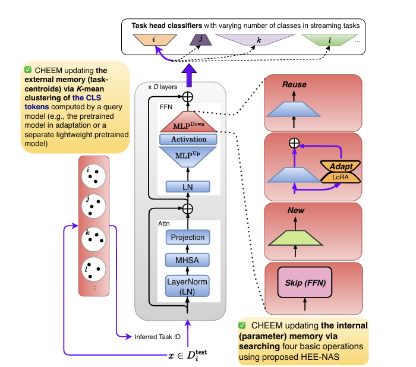

제안하는 CHEEM 프레임워크는 **내부 매개변수 메모리(Internal Parameter Memory)**와 **외부 태스크-센트로이드 메모리(External Task-Centroid Memory)**의 두 가지 독립적인 지속 메모리(Decoupled Continual Memory) 시스템으로 구성된다.

1. **외부 태스크-센트로이드 메모리 (External Memory)**
    - 테스트 data가 들어왔을 때 task ID를 스스로 알아내는 navigator이다.
    - 입력 이미지 x가 들어오면 사전학습된 모델을 통해 이미지의 대표 특징 벡터인 CLS 토큰을 뽑아온다
    - 이미 외부 메모리에 저장되어 있는 기존 테스크들의 대표 벡터 중심점들과 새로 들어온 토큰을 비교한다
    - 이 중심점들은 학습 과정에서 K-means 클러스트링을 통해 지속적으로 업데이트 되어 정교하게 관리된다.
    - 코사인 유사도가 가장 높은 곳을 찾아 태스크 ID를 동적으로 추론하고 그에 맞는 전용 분류 헤드로 신호를 보낸다.

2. **내부 매개변수 메모리 (Internal Memory)**
   - HEE-NAS(Hierarchical Exploration-Exploitation Neural Architecture Search)를 통해, 태스크의 난이도와 유사도에 따라 모델의 특정 컴포넌트
   - Transformer 블록 전체를 다 바꾸는 것은 연산비용이 너무 크다. 따라서 연산 통제가 가능하도록 FFN 블록 내부의 MLPDown 레이어 혹은 MHSA 블록 내부의 Projeection 레이어 둘 중 하나만을 가변형 타킷 컴포넌트로 활용한다.

   - 탐색 공간은 다음 4가지 기본 연산으로 정의된다.
     - **Reuse (재사용):** 
        - 이전 태스크의 매개변수를 그대로 사용 (태스크 간 유사도가 높을 때 지식 전수 극대화).
        - 과거 지식을 Knwoledge trasnfer 받을 수 있어 효율적이며 추가적인 파라미터 증가가 전혀 없다.
     - **Adapt (적응):** 
        - LoRA 컴포넌트를 추가하여 기존 지식을 보존하면서 새로운 태스크에 미세 조정.
        - 파라미터를 극소량만 추가하면서도 새로운 task에 맞춤형 가소성을 부여해 시너지를 낸다.

     - **New (새로운 레이어):** 
        - 이전 태스크와 이질적인 경우 새로운 레이어를 추가하여 새로운 정보 통합.
        - 이전 task와 완전히 다른 이질적인 data가 들어왔을 때 기존 지식의 방해나 간섭 없이 고유의 특징을 빠르ㅗ 깨끗하게 학습할 수 있다.

     - **Skip (건너뛰기):** 
        - 태스크가 매우 쉬운 경우 FFN 혹은 MHSA 블록 전체를 스킵
        - 아주 쉽거나 사전학습 지식만으로 충분히 풀 수 있는 연산을 생략하여 백본 자체를 가볍게 다이어트 시킨다.

### 모델 체급에 따른 실제 동적 변신 사례 (Figure 3b & 3c)

이 4가지 무기를 쥐여줬을 때, 백본 모델의 원래 체급에 따라 구조가 얼마나 지능적으로 변하는지 시각적으로 보여주는 장표입니다.

#### 💡 Figure 3b: 덩치가 크고 똑똑한 'ViT-Base'의 선택
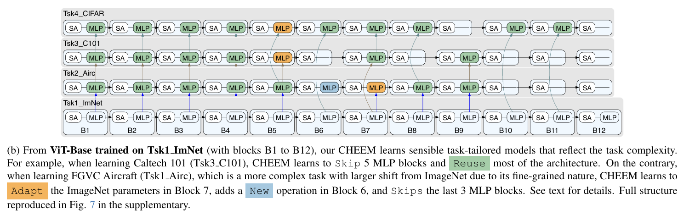

- **Caltech 101 (쉬운 난이도) 학습 시:** 이미 아는 지식으로 충분히 대처가 가능하므로, 5개의 MLP 블록을 그냥 **Skip(건너뛰기)** 해버리고 나머지는 대부분 **Reuse(재사용)** 하여 연산 비용을 획기적으로 아낍니다.
- **FGVC Aircraft (어려운 미세 분류) 학습 시:** 비행기 기종을 아주 미세하게 구분해야 하는 생소하고 어려운 작업이므로, 6번 블록에 완전히 새로운 **New** 레이어를 깔고, 7번 블록은 기존 지식을 튜닝하는 **Adapt**를 수행하며, 학습 능력이 굳이 필요 없는 마지막 3개 블록은 **Skip**하는 환상적인 유연함을 보여줍니다.

#### 💡 Figure 3c: 몸집이 아주 작고 배고픈 'DEiT-Tiny'의 선택
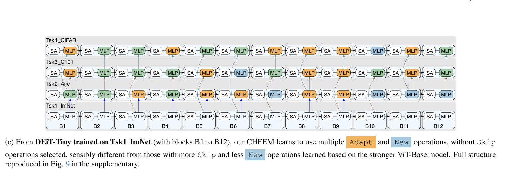

- **행동 패턴:** 모델 자체가 작아서 기본 용량이 부족하다 보니, 어떤 태스크를 만나도 자원을 아끼는 **Skip** 연산은 거의 선택하지 않습니다.
- **전략:** 대신 모델의 수용 용량 한계를 극복하기 위해 적극적으로 **New**와 **Adapt** 연산을 깔아 신경망의 깊이와 두께를 동적으로 성장시키는 전략을 취합니다.

### HEE-NAS
새로운 task t를 학습할 때 모든 경우의 수를 사람이 일일이 test해서 구조를 짤 수는 없다. 그래서 신경망 구조 탐색 NAS 기술을 사용한다.

- 기존 초간단 NAS : 그냥 무작위로 4가지 연산을 찔러보며(pure exploration) 학습시킨다. 이 방식은 시간도 엄청나게 걸리고 과거 지식을 다 망가뜨릴 위험이 크다.

- CHEEM의 제안(HEE-NAS) : 과거 배운 지식들과의 유사도를 미리 계산한 뒤, 유사도가 높고 도움이 될 만한 길 위주로 똑똑하게 집중 탐색을 수행(exploitation)

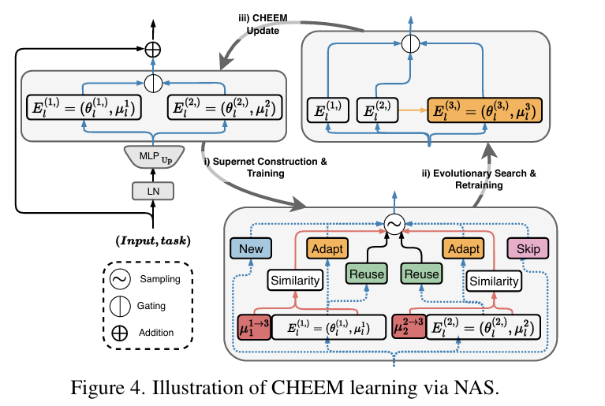

- Supernet 구축 및 학습(Supernet Construction & Training) : 4가지 연산이 얽혀 있는 거대한 탐색 공간(Supernet)을 구성하고 학습
- 진화 알고리즘 탐색 및 재학습(Evolutionary Search & Retraining) : 학습된 후보군 중에서 성능과 연산량의 트레이트오프를 따져서 가장 똑똑한 최종 모델 구조 하나를 진화 법칙으로 낙점하고 재학습.
- CHEEM 업데이트 : 낙점된 최적의 구조로 모델 내부 파라미터 메모리를 업데이트.

#### 1단계 : 유사도를 계산하는 수학적 방법
그렇다면 모델은 새로운 Task $t$가 과거 Task들의 지식과 얼마나 유사한지 어떻게 수식으로 계산할까? (세미나용 핵심 요약)

1. **테스트 데이터 통과시키기 (CLS 토큰 추출)**:
   - 새로운 Task $t$의 학습 데이터가 들어오면, 기존에 완성해 두었던 이전 task들의 네트워크들에 데이터를 통과시켜 이미지의 대표 벡터인 CLS 토큰을 뽑아냅니다.

2. **코사인 유사도(Cosine Similarity) 구하기**:
   - 과거 $i$번째 태스크의 오리지널 대표 토큰($\mu_l^i$)과, 새로운 $t$번째 데이터를 통과시켜 나온 토큰($\mu_l^{i\rightarrow t}$) 사이의 각도를 구합니다.

3. **정규화(Normalization)**:
   - 유사도 점수($S$)를 $-1$에서 $1$ 사이로 정규화하여 태스크 간의 미세한 차이를 더 확실하게 벌려줍니다. 점수가 높을수록 두 태스크가 매우 닮아있다는 뜻입니다.
     $$S_{i,t}^l = \text{NormCosine}(\mu_l^i, \mu_l^{i\rightarrow t})$$

4. **💡 신규(New)와 건너뛰기(Skip)는 유사도가 없는데 어떻게 할까?**
   - 과거 태스크가 아니라 완전히 새로 만들거나(New) 패스하는 것(Skip)은 비교 대상이 없습니다. 이를 위해 가상의 **보조 전문가(Auxiliary Expert, Aux)**라는 개념을 만듭니다.
   - **Aux의 점수 공식**:
     $$S_{aux,t}^l = -\max_{i=1}^{t-1} S_{i,t}^l$$
   - **의미**: "과거 태스크들 중 가장 높은 유사도 점수"에 마이너스($-$)를 붙인 값입니다. 즉, 과거 지식 중 쓸 만한 게 하나도 없을 때(유사도가 극도로 낮을 때), Aux 점수가 올라가서 자연스럽게 **New**나 **Skip**을 선택하도록 확률을 유도하는 정교한 안전장치입니다.

#### 2단계 : 계층적 샘플링(Hierarchical Sampling)의 원리

유사도를 구한 뒤, 이를 탐색 확률로 연결하는 2단계 계층적 샘플링 과정입니다.

- **레벨 1 (어떤 지식을 참고할 것인가?):**
  과거 태스크들의 유사도 점수와 Aux 점수를 가지고 Softmax 함수를 적용하여 categorical 확률 분포 $(\psi_1, \dots, \psi_I)$를 만듭니다. 유사도가 높은 태스크가 높은 선택 확률($\psi$)을 가져갑니다.
  
- **레벨 2 (그 지식을 어떻게 요리할 것인가?):**
  - **과거 태스크 $i$가 선택된 경우**: Bernoulli 분포를 작동시킵니다. 유사도 점수를 Sigmoid 함수에 통과시켜 성공률 $\rho_i$를 구합니다.
    - 이 확률에 따라 완전히 똑같이 가져다 쓰거나(**Reuse**, 확률 $\rho_i$), 혹은 기존 지식을 살짝 튜닝해서 씁니다(**Adapt**, 확률 $1-\rho_i$). *(유사도가 아주 높으면 Reuse 확률이 지배적이 됩니다.)*
  - **Aux(보조 전문가)가 선택된 경우**: 아주 심플하게 **New**와 **Skip**을 각각 **50%의 확률(0.5)**로 반반씩 나누어 샘플링합니다.

---

### 💡 3단계:Exploration과 Exploitation(Section 3.5)

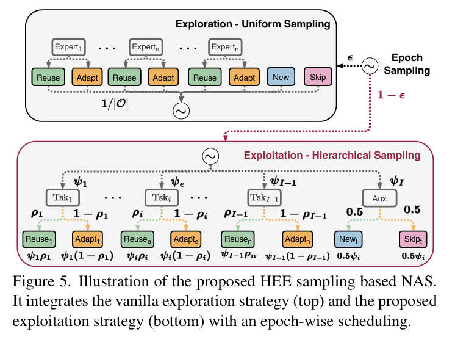

학습을 진행할 때 처음부터 편식하듯 유사한 곳만 계속 파고들면(Exploitation), 더 기발하고 효율적인 아키텍처 구성을 놓칠 수 있습니다. 그래서 CHEEM은 학습 기간(Epoch)에 따라 이 둘을 스마트하게 섞어 씁니다:

- **Pure Exploration (순수 탐색 - Figure 5 상단):** 유사도와 상관없이 4가지 연산을 완전 균등한 확률로 마구 찔러봅니다.
- **Exploitation (계층적 샘플링 - Figure 5 하단):** 유사도가 높은 알짜배기 연산들 위주로 샘플링합니다.

**에폭별 하이퍼파라미터 스케줄링**:
매 에폭이 시작될 때마다 $\epsilon_1$ (예: 0.3)의 확률로 무작위 탐색(Pure Exploration)을 돌리고, $1-\epsilon_1$ (0.7)의 높은 확률로 유사도 기반 계층적 샘플링(Exploitation)을 수행하여 아키텍처 학습 속도를 비약적으로 끌어올립니다.

### Experiments

#### 1. Datasets (실험 데이터셋)

기존의 지속 학습(Continual Learning) 연구들은 클래스 수와 이미지 수가 균일하게 정렬된 인공적인 데이터셋을 주로 사용해 왔습니다. 하지만 CHEEM은 현실 세계의 극심한 데이터 불균형을 그대로 반영하기 위해 아래의 두 가지 까다로운 벤치마크를 채택하여 강건성을 검증했습니다.

| 벤치마크 | 구성 요소 / 태스크 수 | 주요 특징 및 클래스 불균형 사례 |
| :--- | :--- | :--- |
| **MTIL** *(Multi-Task Image Learning)* | • **기본 태스크:** ImageNet (사전 학습용) • **스트리밍 태스크 (11개):** Aircraft, Caltech101, CIFAR100, DTD, EuroSAT, VGG-Flowers, Food101, MNIST, Oxford Pets, Stanford Cars, SUN | • 각 태스크별 학습 이미지 수와 클래스 수가 수십~수백 배까지 극단적으로 차이 남. • **예시:** MNIST (54,000장 / 10개 클래스) vs VGG-Flowers (1,000장 / 102개 클래스) |
| **VDD** *(Visual Decathlon Dataset)* | • ImageNet-1k를 제외한 총 2,128개 전체 클래스로 구성된 도메인 융합 데이터셋 | • 극심한 **클래스 불균형(Class Imbalance)** 검증에 특화. • **예시:** Omniglot (손글씨 문자)은 무려 **1,623개**의 클래스를 포함하는 반면, DTD (질감)는 겨우 **47개**의 클래스만 포함. |

> [!WARNING]
> 데이터 분포와 연산량이 극단적으로 쏠려 있어, 고정된 신경망 크기를 고수하는 기존 모델들은 심각한 **파괴적 망각(Catastrophic Forgetting)**을 겪거나 학습 자체가 실패하게 됩니다.

---

#### 2. Metrics (평가 지표 수식 해독)

모델을 공정하고 다각도로 평가하기 위해 3가지 평가지표를 사용합니다. 특히 **FoM**은 정확도 성능과 계산 효율성의 트레이드오프를 정량화하기 위해 본 논문에서 새롭게 제안한 독창적인 지표입니다.

> [!NOTE]
> **기본 기호 정의:**
> $a_{i,j}$는 태스크 $i$까지 학습을 완료한 모델($F_i$, $H_i$)을 사용하여 태스크 $j$의 테스트 데이터를 평가했을 때 얻은 Top-1 정확도(Accuracy)입니다.

---

##### 📊 ① Average Accuracy (AA, 평균 정확도)
모든 태스크 학습이 완벽하게 끝난 최종 시점(태스크 $N$)에서, 그동안 배웠던 모든 태스크들을 다시 평가하여 얻은 정확도의 평균입니다.

$$AA = \frac{1}{N-1} \sum_{t=2}^{N} \text{Acc}(D_t^{\text{test}}; F_N, H_N) \quad (\text{수식 4})$$

* **의미:** 지속 학습이 끝난 후 모델의 머릿속에 최종적으로 지식이 얼마나 잘 남아있는지 종합 점수를 매기는 핵심 지표입니다. (일반적으로 사전학습용 기본 태스크 $t=1$인 ImageNet을 제외한 나머지 태스크들의 평균 정확도를 계산합니다.)

---

##### 📉 ② Average Forgetting (AF, 평균 망각률)
학습 과정 중에 각 과거 태스크에 대해 기록했던 역대 최고 정확도와 최종 시점($N$)에서의 정확도 간의 격차(망각 발생량)를 구하여 평균을 낸 것입니다.

$$AF = \frac{1}{N-2} \sum_{t=2}^{N-1} \left( \max_{j \in [t, N]} a_{j,t} - a_{N,t} \right) \quad (\text{수식 5})$$

* **의미:** "파괴적 망각"을 얼마나 잘 방어했는지 보여줍니다. 이 값이 $0\%$에 가까울수록 옛날 지식을 굳건히 지켜냈다는 의미입니다.

---

##### 🏆 ③ Figure-of-Merit (FoM, 종합 가성비 점수)
두 경쟁 모델(대상 모델 $m$, 대조군 모델 $n$)을 비교할 때, **정확도 성능**과 **컴퓨터 연산량(Complexity, FLOPs)**이라는 두 마리 토끼를 얼마나 스마트하게 잡았는지 비교·정량화한 효율성 지표입니다.

$$FoM(m, n) = \left( \frac{AA_{\text{UpperBound}} - AA_{n}}{AA_{\text{UpperBound}} - AA_{m}} \right) \cdot \left( \frac{\text{FLOPs}_{n}}{\text{FLOPs}_{m}} \right) \quad (\text{수식 6})$$

* **$AA_{\text{UpperBound}}$**: 지속 학습의 제약 없이 각 태스크를 독립적으로 완전히 미세조정(Full Fine-Tuning)했을 때 도달할 수 있는 **이상적인 최고 성능 한계점(Upper-Bound)**입니다.

> [!TIP]
> **수식의 핵심 작동 원리:**
> 1. **앞부분 (성능 격차 비율):** Upper-Bound 대비 성능 격차의 상대적 크기를 비교합니다. 평가 대상 모델 $m$의 정확도가 상한선에 더 가까울수록(즉, $AA_m$이 커질수록) 분모인 격차 $AA_{\text{UpperBound}} - AA_m$가 작아지므로 전체 FoM 값이 커집니다.
> 2. **뒷부분 (연산량 비율):** 대조군 모델 $n$ 대비 대상 모델 $m$의 계산량이 얼마나 가벼운지 비교합니다. 모델 $m$의 연산 비용($\text{FLOPs}_m$)이 적을수록 분모가 작아지므로 전체 FoM 값이 커집니다.
> 
> **결과 해석:**
> 만약 어떤 모델 $m$이 대조군 $n$보다 성능 격차도 작고 연산량도 적다면 **$FoM(m, n) > 1$**을 만족하게 됩니다. 이 값은 **"모델 $m$이 $n$보다 수학적으로 몇 배 더 효율적이고 우수한 모델인가"**를 직관적으로 나타냅니다.

---

#### 3. Pretrained Models in ExfCCL (실험에 사용된 사전학습 모델)

CHEEM의 범용성과 극단적인 하드웨어 제약 조건 하에서의 성능을 모두 입증하기 위해, 체급과 기초 성능이 판이하게 다른 두 백본(Backbone) 모델을 사용하여 실험을 진행했습니다.

*   **ViT-Base (강력한 대형 모델):**
    *   **설정:** ImageNet-21k에서 대규모 사전 학습을 진행한 후, ImageNet-1k에서 미세 조정(Fine-Tuning)된 강력한 파라미터 백본.
    *   **의미:** 풍부한 사전 지식을 갖춘 상태에서 HEE-NAS가 어떠한 최적의 경로(주로 Skip 및 Reuse)를 개척하는지 확인하는 대조군.
*   **DEiT-Tiny (경량화 모델):**
    *   **설정:** ImageNet-1k로만 학습된 상대적으로 경량화된 모델.
    *   **의미:** 리소스가 극도로 제한되고 기초 체력이 약한 엣지 디바이스 환경에서, CHEEM의 동적 레이어 추가/조정(New, Adapt)이 얼마나 효율적으로 아키텍처를 성장시키는가에 대한 대조군.

> [!NOTE]
> supplementary (Sec. F)에서는 CLIP ViT-Base 백본을 적용했을 때의 추가 실험 결과 또한 보고되어 있습니다.

---

#### 4. Implementation Details (구현 세부사항)

*   **가변 타깃 레이어 (Target Component):** 별도의 명시가 없는 한, 본문의 모든 실험에서 CHEEM은 Transformer 블록 내 FFN(Feed-Forward Network)의 **`MLPDown` 레이어**에 적용되었습니다.
*   **의미:** Transformer 구조 내에서 대부분의 지식(Knowledge)이 저장되는 곳이 FFN 블록 내부라는 연구 결과를 기반으로 한 설계입니다. 블록 전체를 복제하거나 튜닝하는 대신, `MLPDown` 레이어 하나만을 탐색 타깃으로 좁힘으로써 **연산 효율성을 극대화**하고 파라미터 폭발을 방지했습니다. (추가 구현 상세는 부록 Sec. H 참조)

---

#### 5. Baselines and Upper-Bounds (비교 대상 및 상한선 모델들)

CHEEM의 우수성을 다각도로 검증하기 위해 다음과 같은 대조군들과 비교했습니다.

| 구분 | 모델군 / 알고리즘 | 설명 및 특징 |
| :--- | :--- | :--- |
| **규제 기반 (Regularization)** | **EWC** *(Elastic Weight Consolidation)* | 과거 태스크에 중요한 가중치가 변하지 않도록 페널티(Fisher Information)를 부여하는 전통적 지속 학습 기법. |
| **프롬프트 기반 (Prompt-based)** | **CODA-Prompt, Dual-Prompt, L2P, S-Prompts, DIKI** | 백본 가중치는 고정한 채, 태스크별 경량 프롬프트(Prompt)만 학습하는 최신 CL 트렌드 기법들. |
| **매개변수 효율적 (PEFT)** | **Tuna, Moal, LoRA-CL** | 효율적으로 파라미터를 추가하여 튜닝하는 기법들.  • **LoRA-CL:** NAS 탐색을 생략하고 모든 레이어에 일괄적으로 LoRA(Adapt)를 적용한 대조군 (*"NAS 없이 LoRA만 발라도 성능이 충분한가?"* 검증 목적). |
| **최고 성능 상한선 (Upper-Bounds)** | **UpperBoundFull-FT, UpperBoundLoRA-FT** | 지속 학습 제약을 아예 배제하고, 각 태스크별로 완전히 독립적으로 미세조정한 최고 성능치.  • **Full-FT:** 전체 가중치 미세조정  • **LoRA-FT:** LoRA 기반 미세조정 |

---

#### 6. Table 1 분석: CHEEM vs Baselines FoM (종합 가성비 비교)

Table 1은 경쟁 모델 대비 CHEEM이 정확도와 계산 연산량(FLOPs) 사이의 균형을 얼마나 효율적으로 달성했는지를 **Figure-of-Merit (FoM)** 값으로 보여주는 결과입니다. (값이 1보다 클수록 CHEEM이 더 뛰어남을 의미합니다.)

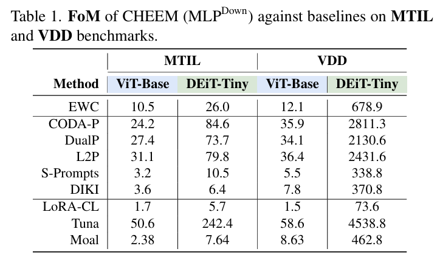

---

##### 💡 깊이 읽기: 왜 DEiT-Tiny & VDD 설정에서 수천 배(L2P 대비 2,431.6배, CODA-P 대비 2,811.3배)의 상상 초월 점수가 나올까?

이러한 폭발적인 수치는 지표의 왜곡이 아닌, **지속 학습의 냉혹한 현실을 보여주는 수학적 결과**입니다.

$$FoM(CHEEM, \text{baseline}) = \left( \frac{AA_{\text{UpperBound}} - AA_{\text{baseline}}}{AA_{\text{UpperBound}} - AA_{CHEEM}} \right) \cdot \left( \frac{\text{FLOPs}_{\text{baseline}}}{\text{FLOPs}_{CHEEM}} \right)$$

1. **기존 프롬프트 기법들의 전멸 (분자 격차 $AA_{\text{UpperBound}} - AA_{\text{baseline}}$의 극대화):**
   * DEiT-Tiny처럼 모델 자체의 파라미터 용량(Capacity)이 부족한 경량 모델에 백본을 얼려두고 프롬프트만 붙이는 기법(CODA-P, L2P 등)을 쓰면, 태스크 ID 추론에 빈번히 실패하고 특징 표현력이 현저히 부족해져 평균 정확도($AA$)가 바닥을 칩니다. 즉, 최고 성능 상한선 대비 오차 격차(분자)가 엄청나게 커집니다.
2. **CHEEM의 한계 도달 (분모 격차 $AA_{\text{UpperBound}} - AA_{CHEEM}$의 극소화):**
   * CHEEM은 고정된 뼈대에 갇혀있지 않고, HEE-NAS를 통해 어려운 태스크에서 동적으로 `New`와 `Adapt` 연산을 확장하여 신경망을 지능적으로 성장시킵니다. 그 결과 성능 훼손이 거의 없이 이상적인 최고 성능 한계점(Upper-Bound)에 근접합니다.
   * 실제로 **VDD 데이터셋 + DEiT-Tiny** 설정에서 **Upper-Bound 성능은 $76.21\%$**인데, **CHEEM은 $76.18\%$**를 달성하여 오차 격차가 단 **$0.03\%$**($0.0003$)에 불과합니다.
3. **수학적 결과:**
   * 분모의 성능 격차($AA_{\text{UpperBound}} - AA_{CHEEM}$)가 **$0.03\%$**로 0에 수렴할 만큼 극도로 작아지다 보니, 전체 FoM 값이 수천 배 단위로 수치적 폭발(Explosion)이 일어나게 된 것입니다.

> [!IMPORTANT]
> **결론:**
> 이는 **"기본 모델의 체급이 작고 부실할수록, 스스로 신경망 구조를 유연하게 변신시키는 CHEEM의 계층적 탐색 알고리즘이 제공하는 실질적 가치가 압도적으로 커진다"**는 점을 수학적으로 완벽히 입증합니다.

---

#### 7. Table 2 & Table 3 분석: CHEEM vs Upper-Bound Fine-Tuning

Table 2와 Table 3은 지속 학습 제약이 없는 이상적 최고 성능인 **미세조정(Fine-Tuning) 상한선 모델들**과 **CHEEM**의 정확도 및 연산량을 비교한 결과입니다.

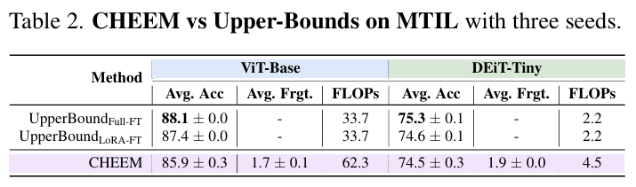
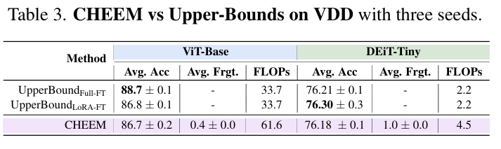

##### 🔑 핵심 비교 분석

1. **상한선(Upper-Bound)에 근접한 정확도**
   지속 학습 제약 하에서 학습했음에도 불구하고, CHEEM은 어떠한 망각도 없이 개별 태스크를 독립적으로 완전히 미세조정한 성능(Upper-Bound)에 거의 육박했습니다.
   * **MTIL 벤치마크 결과:**
     * **ViT-Base:** CHEEM **$85.9\%$** vs 상한선 **$88.1\%$** (격차 단 **$2.2\%$**)
     * **DEiT-Tiny:** CHEEM **$74.5\%$** vs 상한선 **$75.3\%$** (격차 단 **$0.8\%$**)
   * **VDD 벤치마크 결과:**
     * **ViT-Base:** CHEEM **$86.7\%$** vs 상한선 **$88.7\%$** (격차 단 **$2.0\%$**)
     * **DEiT-Tiny:** CHEEM **$76.2\%$** vs 상한선 **$76.2\%$** (**사실상 완벽 일치!**)

2. **💡 FLOPs(연산량)의 숨겨진 비하인드 (2배 상승의 이유)**
   표를 보면 CHEEM의 연산량(FLOPs)이 단순 단일 경로 백본 대비 약 2배 가까이 증가하는 모습을 보입니다. 이는 다른 프롬프트 기반(Prompting-based) 기법들도 공통적으로 마주하는 현실적인 연산 트레이드오프입니다.
   * **원인:** 테스트 이미지가 들어왔을 때, 모델은 이것이 어떤 태스크인지 식별하는 **Task ID 추론(Inference)**을 먼저 수행해야 합니다.
   * **추가 연산 발생:** 이 추론을 위해 초기 백본(Initial Backbone)에 이미지를 통과시켜 CLS 토큰을 추출하는 **추가적인 순방향 연산(Forward Computation)**이 1회 더 필요하게 됩니다. 이후 추론된 Task ID에 맞춰 타깃 네트워크 경로로 실제 분류 연산을 수행하므로, 실질적인 FLOPs가 약 2배 가까이 곱해지게 됩니다.

> [!NOTE]
> 비록 Task ID 인프라 비용 때문에 연산 효율이 단일 전파 대비 2배로 계산되지만, 파라미터 메모리를 효율적으로 아끼면서 상한선에 준하는 성능을 낸다는 점에서 CHEEM의 범용적 실용성을 가장 강력하게 뒷받침하는 지표입니다.

---

#### 8. Table 4 & Table 5 분석: CHEEM vs Baselines (정밀 성능 비교)

Table 4와 Table 5는 MTIL 및 VDD 벤치마크에서 CHEEM과 다양한 베이스라인 기법들의 평균 정확도(Average Accuracy)와 연산 효율성(FLOPs)을 정밀 비교한 상세 결과표입니다.

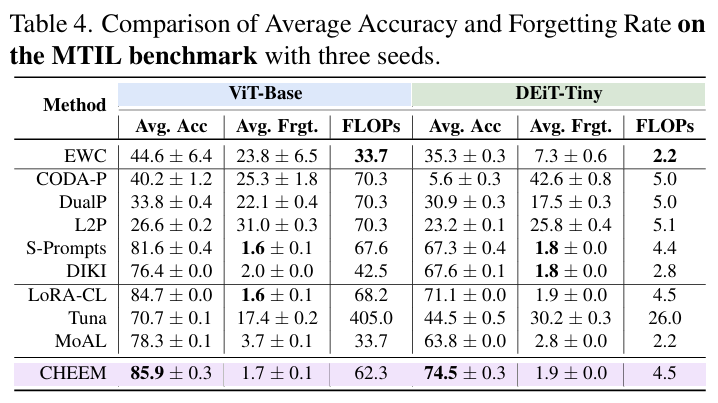
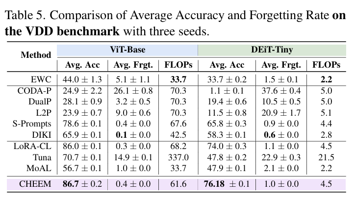

##### 🔑 핵심 비교 분석

1. **규제 기반 기법(EWC)의 한계: 연산량 최소, 그러나 심각한 망각**
   * **특징:** EWC는 하나의 백본 네트워크만을 계속해서 공유하므로 추가 파라미터가 없어 **FLOPs는 가장 낮습니다**.
   * **결과:** 하지만 단일 백본 가중치를 규제하는 것만으로는 불균형 스트리밍 데이터셋의 가소성을 감당할 수 없었습니다. 결국 **파괴적 망각(Catastrophic Forgetting)**으로 인해 평균 정확도가 **ViT-Base에서 44.58%**, **DEiT-Tiny에서 35.33%**로 매우 처참하게 무너졌습니다.

2. **DIKI의 트레이드오프: 낮은 연산량과 맞바꾼 성능**
   * **결과:** DIKI 역시 상대적으로 낮은 FLOPs를 보여주지만, 성능(정확도) 면에서 눈에 띄게 큰 희생을 겪어 CHEEM 대비 종합적인 가성비가 떨어집니다.

3. **LoRA-CL과의 비교: Skip 연산의 중요성 증명**
   * **결과:** CHEEM에서 구조 탐색(NAS) 없이 LoRA만 일괄 적용한 **LoRA-CL**은 평균 정확도 면에서는 CHEEM과 다소 유사한 수준을 보였습니다.
   * **차이점:** 그러나 모든 모듈에 LoRA를 장착하여 실행하므로 **스킵(Skip) 연산을 전혀 수행할 수 없어 FLOPs가 불필요하게 높습니다**. 즉, CHEEM이 HEE-NAS를 통해 쉬운 블록을 건너뛰는(Skip) 자원 절약 전략이 얼마나 실용적인지 완벽하게 증명합니다.

> [!TIP]
> **Table 1의 FoM 폭발(2,000배 이상) 복습:**
> VDD 데이터셋의 DEiT-Tiny 설정에서 CHEEM이 보여준 상한선 성능 근접도(**76.18%** vs 상한선 **76.21%**)는 오차율을 단 **0.03%**로 좁혔습니다. 이로 인해 식 6의 성능 격차 분모가 0에 가깝게 작아지면서, 베이스라인 대비 수천 배 높은 FoM을 획득하게 되었습니다.

---

#### 9. 태스크 난이도 인지(Task-Difficulty Awareness)와 독창적 아키텍처 (Table 6)

직관적으로, 난이도가 쉬운 태스크는 어려운 태스크보다 훨씬 적은 연산량(FLOPs)으로도 충분히 해결할 수 있어야 합니다. CHEEM은 HEE-NAS를 통해 이를 동적으로 자가 판별하고 리소스를 유연하게 분배합니다.

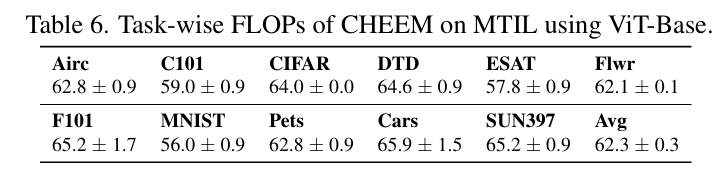

##### 🔑 핵심 요약
*   **태스크 난이도별 자원 차등 배분:** Table 6을 보면, MNIST나 EuroSAT(ESAT) 같이 패턴이 단순하고 직관적인 쉬운 태스크에서는 FLOPs를 매우 낮게 할당하는 반면, 어려운 태스크에는 고출력 연산 자원을 집중시킵니다.
*   **독특하고 "불규칙한(Irregular)" 아키텍처의 탄생:** 
    *   그림 3b(ViT-Base 구조)에서처럼, CHEEM이 찾아낸 최적의 아키텍처는 사람이 직관적으로 설계하기 어려운 재미있는 형태를 띱니다.
    *   예를 들어, 2개의 연속된 Transformer 블록 중 하나는 토큰 간의 정보를 섞어주는 **Attention(MHSA) 레이어만 포함**하고, 채널 간 정보를 결합하는 **FFN 블록은 아예 Skip(생략)** 해버리는 특이한 구조가 자동으로 학습되었습니다.
*   *참고:* 부록(Sec. F, Fig. 6)에서도 VDD 데이터셋 상에서 CHEEM이 동적으로 학습한 직관적이고 합리적인 아키텍처 변화를 확인할 수 있습니다.

---

#### 10. 합리적인 학습 오버헤드 (Reasonable Training Overhead) (Table 7)

신경망 구조 탐색(NAS) 기법은 대개 학습 단계에서 엄청난 시간과 연산 비용(Search Overhead)을 소모하는 것으로 알려져 있습니다. CHEEM은 이 학습 오버헤드를 얼마나 실용적인 수준으로 통제했는지 Table 7에서 입증합니다.

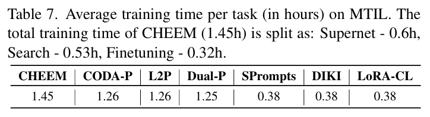

##### 🔑 핵심 요약
*   **SOTA 기법들과 견줄 만한 총 학습 시간:** 
    *   CHEEM의 전체 파이프라인(Supernet 학습 + 구조 탐색 + 미세조정)의 총 학습 시간 오버헤드는 대세 프롬프트 기법인 L2P, DualPrompt, CODA-Prompt에 비해 **매우 미미한 수준의 증가(marginal increase)**에 불과합니다.
*   **훈련 비용 vs 추론 비용의 트레이드오프:**
    *   단순 프롬프트 모델인 S-Prompts, DIKI 또는 탐색이 없는 LoRA-CL에 비해서는 학습 단계의 오버헤드가 더 크지만, **최종 모델의 추론(Inference) 단계 FLOPs를 대폭 낮추고 동시에 훨씬 높은 평균 정확도(AA)를 달성**했습니다.
    *   즉, 학습할 때 구조 탐색을 위해 시간과 비용을 조금 더 쓰더라도, **실제 서비스에 탑재되어 실행되는 추론 시점의 연산 비용(FLOPs)을 대폭 깎고 정확도를 최상급으로 끌어올려 실전 가성비를 극대화**했습니다.

---

#### 11. Ablation Studies
##### ① CHEEM-lite: Task ID 탐색 비용의 극소화
*   **아이디어:** 앞선 실험에서 단일 경로 대비 연산량이 2배로 증가했던 원인인 **Task ID 추론용 초기 백본**을 기존 메인 백본보다 훨씬 가벼운 경량 모델(Lightweight pretrained backbone)로 대체하는 방식입니다.
*   **결과:** 이 경우 추가적으로 발생하는 FLOPs 오버헤드를 **무시할 수 있는 수준(negligible)**으로 대폭 절감하면서도, 베이스라인 모델들의 성능을 여전히 여유롭게 앞질렀습니다. (상세 내용은 부록 Section G 참조)

---

##### ② CHEEM 위치 선정: MLPDown vs. Projection (Table 8)
어댑터와 가변 레이어를 Transformer 블록 내의 FFN의 `MLPDown`에 장착할 것인지, 아니면 MHSA(Attention)의 `Projection(AttnProj)`에 장착할 것인지에 대한 위치 비교 실험입니다.

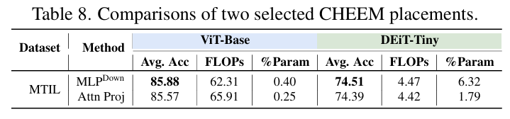

*   **정확도 비교:** 두 위치 모두 평균 정확도(Avg. Acc) 측면에서는 거의 대등한(on-par) 성능을 보여줍니다.
*   **연산 효율성(FLOPs) 비교:** 하지만 연산 효율 측면에서는 **`MLPDown`이 훨씬 유리**합니다. FFN 블록의 연산 비중이 MHSA 블록보다 크기 때문에, FFN 블록 전체를 건너뛰는(Skip) 것이 MHSA 블록을 건너뛰는 것보다 **FLOPs 감소 폭(연산량 절감 효과)이 훨씬 컸기 때문**입니다.

---

##### ③ NAS 샘플링 전략: HEE(계층적 탐색) vs. Uniform(균등 무작위 탐색) (Table 9)
슈퍼넷(Supernet) 학습 시, CHEEM이 제안한 유사도 기반의 계층적 탐색(HEE)을 사용할 때와 모든 연산을 똑같은 확률로 마구 찔러보는 무작위 탐색(Uniform/Pure Exploration)을 사용할 때의 비교입니다.

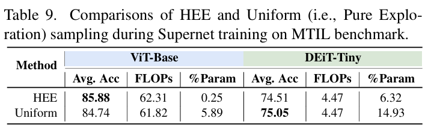

*   **정확도 비교:** 두 방식 모두 최종 정확도는 큰 차이가 나지 않습니다. 이는 CHEEM이 정의한 4가지 기본 연산(Reuse, Adapt, New, Skip) 자체의 **표현 성능(Representational Power)**이 매우 우수함을 방증합니다.
*   **파라미터 효율성(% Param) 비교 (결정적 차이):** 
    *   무작위 탐색(Uniform)은 태스크 간의 상관관계(Synergy)를 활용하지 못해 파라미터가 추가되는 `New`와 `Adapt` 연산을 과도하게 선택하게 됩니다. 그 결과 신규 가중치가 무분별하게 급증했습니다.
        *   **ViT-Base:** Uniform (**$5.89\%$** 증가) vs HEE (**$0.25\%$** 증가) — *약 23배 차이*
        *   **DEiT-Tiny:** Uniform (**$14.93\%$** 증가) vs HEE (**$6.32\%$** 증가) — *약 2.3배 차이*
    *   **의의:** **HEE-NAS**는 태스크 간의 유사도 시너지를 똑똑하게 활용함으로써, 정확도는 유지하되 훨씬 더 **경제적이고 파라미터가 극도로 절약되는 지속 학습**을 가능케 함을 입증합니다.

---

##### ④ 태스크 순서에 따른 강건성 (Effect of Task Orders)
*   **결과:** 스트리밍 형태로 들어오는 태스크들의 학습 순서가 바뀌더라도 CHEEM은 성능 변동이 거의 없이 매우 강건함(Insensitive)을 보여주었습니다. (상세 수치는 부록 Table 11 참조)
