# Octopus: History-Free Gradient Orthogonalization for Continual Learning in Multimodal Large Language Models

## 📌 기본 정보

* **저자:** Yuehao Liu, Shanyan Guan, Weijia Zhang, Xuanming Shang, Yanhao Ge, Wei Li, Chao Ma
* **학회/저널:** CVPR
* **발표 연도:** 2026년
* **논문 링크:** [arXiv:2605.14938](https://arxiv.org/abs/2605.14938) / [Project Page](https://fxmangd26.github.io/Octopus/)
* **핵심 키워드 (Keywords):** Continual Learning, Multimodal Large Language Models (MLLMs), History-Free Gradient Orthogonalization (HiFGO), Catastrophic Forgetting, LoRA (Low-Rank Adaptation)

---

## 1. 연구 배경 및 동기

* **해결하고자 하는 문제:**
  * MLLM Continual Learning 시 발생하는 Catastrophic Forgetting 방지 — Plasticity와 Stability의 균형 달성.

## 2. 핵심 방법론

* **핵심 아이디어:**
  * 과거 데이터 없이 현재 데이터로 이전 가중치의 그래디언트(GPWC)를 구해, 새 업데이트 방향과 직교하도록 강제하는 **HiFGO** + **2단계 미세조정** 전략.

* **상세 아키텍처 및 알고리즘:**
  * 테일러 전개로 무손실 조건 = 그래디언트 직교성임을 수학적으로 도출. 이전 가중치 $\theta_j^\prime$에 현재 데이터를 통과시켜 GPWC 산출 → 현재 업데이트 $\theta_i$와 직교 제약 부과.
  * **Stage 1:** 규제 없이 자유 학습(Optimal Manifold 진입) → **Stage 2:** HiFGO + L2 규제 활성화하여 정교 미세조정.

---

## 3. 실## 5. 논문 읽어보기

### Abstract & Introduction

* **연구 목적 및 배경:**
  * 다중 모달 거대 언어 모델(MLLM)의 지속 학습(Continual Learning) 시 발생하는 **Catastrophic Forgetting** 방지 및 Plasticity-Stability 최적 균형 확보.

* **기존 연구의 한계:**
  * 기존의 구조 기반, 리허설 기반, 규제 기반 기법들은 각각 추론 연산 오버헤드, 프라이버시 침해 및 메모리 저장 비용, 혹은 실질적인 그래디언트 간섭 방지 불가 등의 한계를 지님 (상세 분석은 **Related Work** 섹션 참고).

* **본 논문의 제안 - Octopus:**
  1. **HiFGO (History-Free Gradient Orthogonalization):** 과거 데이터 없이 과거 가중치(Weights)와 현재 데이터만을 이용해 그래디언트 공간에서의 직교성 제약(GPWC)을 강제하는 기법.
  2. **2단계 미세조정 전략 (Two-stage Finetuning):** 최적화와 규제 조건 간의 경쟁 문제를 해결하기 위해, 1단계(자유 학습)로 최적해 영역 안착 후 2단계(규제 활성화)로 정교하게 미세조정하는 전략.

* **Results:**
  * UCIT 벤치마크 실험 결과, 기존 SOTA 대비 평균 성능 및 최종 성능을 대폭 향상하며 과거 데이터를 보관하지 않고도 멀티태스크 학습 성능에 근접하는 우수성 입증 (상세 수치는 **Experiments** 섹션 참고).

### Related Work

#### 1. PEFT

새로운 작업마다 거대한 MLLM을 전체 미세조정(Full Fine-Tuning)하는 것은 저장 공간 및 연산 비용 측면에서 비효율적임에 따른 다양한 PEFT 기법 제안.

* **Adapters & AdaptFormer:** 사전 학습된 네트워크에 소규모 학습 모듈을 추가하지만, 모델 복잡도가 증가하고 작업 간의 완전한 격리(Isolation) 보장 불가.

* **Prompt & Prefix-Tuning:** Transformer 레이어에 학습 가능한 soft prompt 벡터를 삽입하지만, 입력 수준의 제어에 국한되어 복잡한 작업에서의 표현력(Expressiveness) 한계 존재.

* **LoRA:** 가중치 업데이트를 Low-rank matrices로 분해하여 학습 효율을 극대화하는 기법. MLLM 미세조정의 주류로 자리 잡았으며 전체 미세조정 대비 망각 현상이 적음 (상세 수식은 **Preliminaries** 섹션 참고).

#### 2. Conventional Continual Learning

일반적인 딥러닝 모델의 지속 학습에서 forgetting 완화를 위해 제안된 고전적 방법론.

* **Regularization-based:** EWC, LwF 등은 이전 작업에서 중요도가 높았던 매개변수의 업데이트에 패널티를 부여하여 지식 보존.

* **Rehearsal/Replay-based:** DER, DGR, GEM 등은 과거 데이터나 가상 데이터를 보존/재현하고 재학습 과정에 포함하여 이전 지식 유실 완화.

* **Architecture-based:** Piggyback 등과 같이 태스크가 추가될 때마다 전용 모듈이나 매개변수를 동적으로 확장하는 방식.

#### 3. Continual Learning for MLLMs

* **MoE 기반 (HiDe-LLaVA, MoILE 등):** 라우팅(Routing) 메커니즘을 통해 작업별 Expert모듈을 선택적으로 활성화. 

* **그래디언트 직교화 기반 (Orthogonal Gradient Strategies):**
  * **OGD (Orthogonal Gradient Descent):** 
    * 업데이트 방향을 이전 그래디언트들의 직교 공간으로 제한하여 간섭 방지.
    * **이전 작업의 데이터를 계속 Rehearsal해야 하는 한계** 존재.
  * **대안 기법 (OLoRA, BiLoRA, InfLoRA 등):**    
    * gradient 저장 부담을 줄이기 위해 매개변수 벡터 등으로 대체(Projection)하여 데이터 저장 문제를 해결 시도
    * 효과가 제한적이며 Plasticity-Stability tradeoff 문제 직면.

### Preliminaries

#### 1. LoRA

LoRA는 PTM을 효율적으로 Fine-tuning하기 위한 대표적인 PEFT.

* **개념:** 가중치 업데이트 양 $\Delta W$를 두 개의 저차원 행렬 $A$와 $B$의 곱으로 모델링하여 학습 매개변수의 대폭 축소.

* **기본 수식 (Weight Update):**
  $$\Delta W = B A$$
  여기서 $A \in \mathbb{R}^{r \times k}$, $B \in \mathbb{R}^{d \times r}$ 이며, 랭크(Rank) $r \ll \min(d, k)$.

* **조정된 가중치 (Adapted Weight):**
  $$W = W_0 + \Delta W = W_0 + B A$$
  학습 중 기저 모델의 $W_0$는 Freeze되고, 오직 $A$와 $B$만 업데이트.

#### 2. Continual Learning

모델 매개변수를 $\theta$, 순차적인 작업 $T_i$의 데이터셋을 $\mathcal{D}_i = \{(x_k, y_k)\}$라 할 때, 지속 학습은 다음의 확률론적 목적 함수를 극대화하는 것을 목표로 함.

* **확률론적 목적 함수 (CL Objective):**
  전체 작업 시퀀스에 대한 기대 예측 우도(Expected Predictive Likelihood) 최대화:
  
  $$\theta^* = \arg\max_{\theta} \frac{1}{N} \sum_{i=1}^{N} \frac{1}{|\mathcal{D}_i|} \sum_{(x_k, y_k) \in \mathcal{D}_i} \log p_{\theta}(y_k \mid x_k)$$
  
  여기서 $p_\theta(y_k \mid x_k)$는 모델 하에서 입력 $x_k$에 대한 레이블 $y_k$의 조건부 확률.

### Analysis on Parameter Interference

#### 1. Notations 정의

* $W_0$: MLLM의 사전 학습된 원래 가중치 
* $\theta_i$: 작업(Task) $i$를 Fine-tuning하여 학습된 LoRA 매개변수
* $\mathcal{D}_i$: 작업 $i$의 학습 데이터셋
* $\mathcal{L}_{\mathcal{D}_i}(\theta)$: 가중치 $\theta$를 가졌을 때, 데이터셋 $\mathcal{D}_i$에서 계산되는 손실 함수(Loss)의 기댓값
* **2개 태스크 순차 학습 가정:** 설명을 명확히 하기 위해 작업 1 학습 직후 모델 전체 가중치를 다음과 같이 정의:
  $$\theta_1^\prime = W_0 + \theta_1$$

#### 2. 무손실 조건의 정의

* **목표:** 작업 2 학습($\theta_2$ 업데이트) 후에도 이미 학습한 작업 1의 성능이 저하되지 않도록 제어.

* **수식적 표현 (식 4):** 작업 2 가중치가 가산된 후에도 작업 1 데이터셋 $\mathcal{D}_1$에서의 손실 값이 이전과 완전히 동일함으로 정의.
  $$\mathcal{L}_{\mathcal{D}_1}(\theta_1^\prime) = \mathcal{L}_{\mathcal{D}_1}(\theta_1^\prime + \theta_2)$$

#### 3. 테일러 전개(Taylor Expansion)를 통한 수식 단순화

* **테일러 1차 근사 전개 (식 5):** 식 (4)의 우변을 현재 가중치 상태 $\theta_1^\prime$을 기준으로 전개:
  $$\mathcal{L}_{\mathcal{D}_1}(\theta_1^\prime + \theta_2) = \mathcal{L}_{\mathcal{D}_1}(\theta_1^\prime) + \left\langle \frac{\partial \mathcal{L}_{\mathcal{D}_1}(\theta_1^\prime)}{\partial \theta_1^\prime}, \theta_2 \right\rangle + \mathcal{O}(\|\theta_2\|^2)$$
  여기서 $\langle \cdot, \cdot \rangle$은 두 벡터의 내적(Dot Product)을 의미하며, $\mathcal{O}(||\theta_2||^2)$은 2차 이상의 고차 잔여 항(Residual terms).

* **고차항 무시 가설:** LoRA 가중치 $\theta_2$는 기저 모델 가중치 $W_0$에 비해 크기(Magnitude)가 매우 작으므로, 극소함에 따른 고차항 $\mathcal{O}(||\theta_2||^2)$ 무시 가능.

* **수렴된 무손실 조건 (식 6):** 무손실 조건을 만족하기 위해 최종적으로 두 벡터의 내적 0 수렴 필요.
  $$\left\langle \frac{\partial \mathcal{L}_{\mathcal{D}_1}(\theta_1^\prime)}{\partial \theta_1^\prime}, \theta_2 \right\rangle = 0$$

* **물리적 의미:** **작업 1 데이터로 계산한 순간 그래디언트 방향**과 **새로 학습할 작업 2의 가중치 업데이트 방향($\theta_2$)**이 서로 **Orthogonal**해야만 이전 지식의 완벽한 방지 가능.

#### 4. 기존 'Parameter Orthogonality'의 한계

EWC, O-LoRA 등 기존 규제 방식은 가중치 매개변수 자체를 직교하도록 제약($\langle \theta_1, \theta_2 \rangle = 0$) 부과. 단, 저자들은 forgetting 완화 실패를 지적:

* **누적 궤적 vs 순간 그래디언트:** 학습된 가중치 $\theta_1$은 $W_0$에서 Local optimum까지 이동한 **누적 궤적**인 반면, 무손실 조건(식 6)에서 요구하는 것은 최적점에서의 **순간적인 그래디언트 방향에 해당**.

* **방향 불일치:** 최적화 과정 동안 그래디언트의 방향은 계속 변화하기 때문에 최종 가중치 벡터 $\theta_1$이 일관된 그래디언트 방향 대변 불가. 이에 따라 가중치 공간 직교성 제약은 실질적 그래디언트 간섭 방지 불가.

#### 5. 기존 '그래디언트 직교성'의 실무적 한계 (과거 데이터 필요)

1. **과거 데이터 의존성 (Rehearsal-Free 제약 위배):** 과거 그래디언트를 구하기 위해 과거 데이터 $\mathcal{D}_1$이 필수적이나, 실제 환경에서는 프라이버시 및 용량 문제로 유실되는 경우가 다수 존재.
2. **미세 진동하는 그래디언트 노이즈 (Weak & Oscillatory Gradient):** 이전 작업 매개변수는 이미 수렴 상태이므로 최적점에서의 그래디언트는 매우 작고 노이즈성 진동을 띄어 규제 신호로서의 효용성 상실.

#### 6. 돌파구: Figure 2 (우측 STAGE 2)로 보는 해결책

* **과거 데이터 배제 (NO Need):** 과거 데이터 $\mathcal{D}_1$의 저장/참조 배제.

* **GPWC (Gradients of Previous parameters Within Current data distribution):** 과거 가중치 $\theta_1$에 현재 데이터(Data 2)를 통과시켜 현재 데이터 분포 하에서의 과거 매개변수의 그래디언트 산출.

* **직교 제약 적용:** 계산된 GPWC 방향과 현재 작업 가중치 업데이트 방향 간의 직교성을 강제하여, 과거 데이터 없이도 두 작업 간의 최적화 충돌 방지.

### History-Free Gradient Orthogonalization

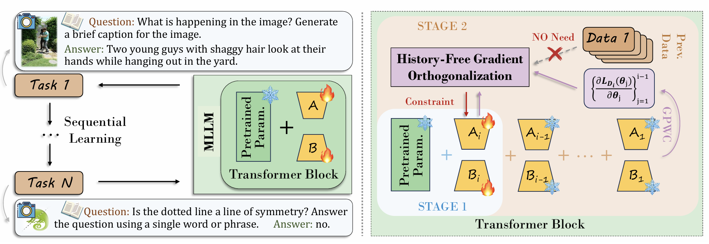

#### 1. GPWC: 과거 데이터 없이 충돌을 감지하는 아이디어

* **핵심 목표:** 과거 작업 데이터에 전혀 접근하지 않고도, 현재 작업과 이전 작업들 간의 상호 영향(Mutual Influence)을 정확하게 파악하는 것.

* **해결책 (GPWC 제안):** **현재 데이터 분포 내에서 이전 매개변수들의 그래디언**을 통해 작업 간의 간섭을 정량화.

* **핵심 분석 (왜 현재 데이터로 과거 가중치를 테스트하는가?):**
  * 이전 작업의 가중치 $\theta_j^\prime$들은 이미 해당 도메인에서 최적화(수렴)를 마친 상태임.
  * 이 수렴된 가중치에 **현재 새로운 데이터 $\mathcal{D}_i$**를 통과시켜 그래디언트를 산출.
  * 이때 검출되는 GPWC은 두 작업이 공유하는 지식 영역을 보여주는 동시에, "현재 데이터를 학습할 때 가중치를 이 방향으로 움직이면 이전 지식이 망가진다"는 최적화 충돌 방향을 지시.

#### 2. 그래디언트 직교 규제 (Equation 7)

* **목표:** 현재 매개변수 $\theta_i$와 GPWC 간의 직교성을 강제하는 그래디언트 직교성 제약 조건 도입을 통한 간섭 완화.

* **손실 함수 수식 (식 7):**
  $$\mathcal{L}_{\text{orth}}(\theta_i) = \sum_{j=1}^{i-1} \left( \frac{\partial \mathcal{L}_{\mathcal{D}_i}(\theta_j^\prime)}{\partial \theta_j^\prime} \right)^T \theta_i$$

* **수식 세부 분석:**
  * $\theta_j^\prime = W_0 + \sum_{m=1}^{j} \theta_m$: 작업 $j$까지 누적된 과거 가중치 합.
  * $\frac{\partial \mathcal{L}_{\mathcal{D}_i}(\theta_j^\prime)}{\partial \theta_j^\prime}$: **현재 데이터 $\mathcal{D}_i$**를 사용해 과거 가중치 $\theta_j^\prime$ 기준으로 미분하여 구한 GPWC.
  * $(\cdot)^T \theta_i$: 산출된 GPWC 벡터와 현재 학습 대상 가중치 $\theta_i$의 내적(Dot Product).

* **물리적 의미:** 손실 함수 $\mathcal{L}_{orth}$를 최소화(0으로 수렴)하는 것은 새로운 가중치 업데이트 방향($\theta_i$)을 과거 지식을 파괴하는 방향(GPWC)과 완전히 90도 직교하게 정렬함을 의미.

### Two-stage Finetuning Strategy

#### 1. 문제 의식: 2단계 미세조정의 필요성

* **L2 가중치 규제 항($\mathcal{L}_{norm}$) 도입 배경:**
  * 4.1장의 테일러 전개 시 LoRA 매개변수의 극소 크기를 전제로 고차 잔여 항을 무시함.
  * 실제 학습 과정에서 가중치 증가에 따른 고차항 에러 누적 발생.
  * 이를 억제하기 위해 가중치 스케일을 제한하는 L2 규제 항($\mathcal{L}_{norm}$) 도입이 필수적임.

* **초기 규제 도입의 부작용 (성능 저하):**
  
  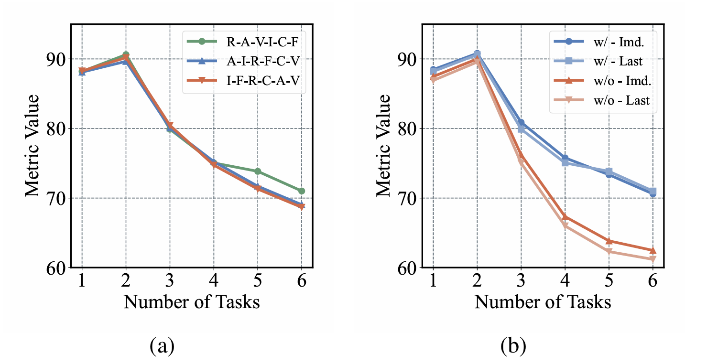
  
  * 학습 초기부터 강한 규제 적용 시 미세조정 성능의 대폭 하락 관측.

* **성능 저하의 원인 분석:**
  1. 규제 제약으로 인한 매개변수 유효 Search Space의 축소.
  2. 본래 작업 학습 목적 함수($\mathcal{L}_{ce}$)와 anti-forgetting 규제 함수($\mathcal{L}_{orth}$, $\mathcal{L}_{norm}$) 간의 간섭으로 Suboptimal Local Minima에 수렴.

#### 2. STAGE 1: 제약 없는 자유 적응 (Stage-1 Finetuning)

* **작동 방식:** 모든 규제 제약($\mathcal{L}_{orth}$, $\mathcal{L}_{norm}$)을 비활성화하고, 현재 데이터 $\mathcal{D}_i$만으로 학습하여 로컬 최적 영역으로 자유롭게 이동.

* **손실 함수 (식 9):**
  $$\mathcal{L}_1 = \frac{1}{|\mathcal{D}_i|} \sum_{(x_k, y_k) \in \mathcal{D}_i} \mathcal{L}_{\text{ce}}(f_{\theta_{i,1}^\prime}(x_k), y_k)$$

#### 3. STAGE 2: 규제 하에 정교한 미세 조율 (Stage-2 Finetuning)

* **작동 방식:** 1단계에서 안착한 Optimal Manifold를 시작점으로 설정. 1단계 가중치 값을 초기값으로 삼고, HiFGO 규제($\mathcal{L}_{orth}$)와 가중치 스케일 규제($\mathcal{L}_{norm}$)를 활성화하여 미세조정 진행.

* **손실 함수 (식 10):**
  $$\mathcal{L}_2 = \frac{1}{|\mathcal{D}_i|} \sum_{(x_k, y_k) \in \mathcal{D}_i} \left( \mathcal{L}_{\text{ce}}(f_{\theta_{i,2}^\prime}(x_k), y_k) + \lambda_1 \mathcal{L}_{\text{orth}}(\theta_{i,2}) + \lambda_2 \mathcal{L}_{\text{norm}}(\theta_{i,2}) \right)$$

* **Figure 2 (STAGE 2)와의 관계:**
  * 보라색 HiFGO 모듈 활성화.
  * 현재 데이터(Data 1)와 이전 가중치들을 통해 구한 GPWC 방향 기반으로 현재 가중치($A_i, B_i$)에 직교 제약(Constraint)을 적용하여 업데이트 방향 조정.

#### 4. 2단계 전략의 파급력 개요

* **성능 효과:** 2단계 미세조정 미적용 시(w/o) 적용 시(w/) 대비 약 **9.83%p의 성능 하락**이 발생하여, 규제 기반 지속 학습 모델의 고질적인 성능 한계(성능 천장)를 극복하는 핵심 열쇠임을 증명 (상세 결과 및 그래프는 **Experiments** 섹션의 Table 3 및 Figure 5b 참고).

### Experiments

#### 1. 실험 환경 (Experimental Setup)

* **벤치마크 (UCIT):** MLLM의 실질적인 지속 학습 능력을 평가하기 위해 고안된 벤치마크. 다음의 6가지 고유한 도메인과 데이터셋이 순차적으로 모델에 입력되어 도메인 변화와 Catastrophic Forgetting 유도:
  * **ImageNet-R:** 이미지 분류 영역
  * **ArXivQA:** 학술 QA 영역
  * **VizWiz:** 시각적 질문 답변(VQA) 영역
  * **IconQA:** 아이콘 인식 및 QA 영역
  * **CLEVR-Math:** 수학적 추론 영역
  * **Flickr30k:** 이미지 캡셔닝 영역

* **주요 평가 지표 (Metrics):**
  * **Last (최종 정확도):** 모든 6개 태스크를 순차적으로 다 학습한 직후 측정하는 전체 태스크의 평균 정확도 (가장 핵심적인 지표).
  * **Avg (평균 정확도):** 학습 단계마다 수행된 성능들의 평균값.
  * **Imd. (즉시 정확도):** 특정 태스크를 학습한 바로 직후에 측정된 성능으로, 해당 태스크가 도달할 수 있는 사실상의 성능 상한선(Upper Bound)을 의미.
  * **BWT (Backward Transfer, 역전이):** 이전 태스크들의 성능 저하(forgetting 정도)를 보여주며, **양이 될수록 성능이 오히려 향상(Positive Transfer)**되었음을 의미.

#### 2. 메인 결과 (Main Results) - SOTA의 경신

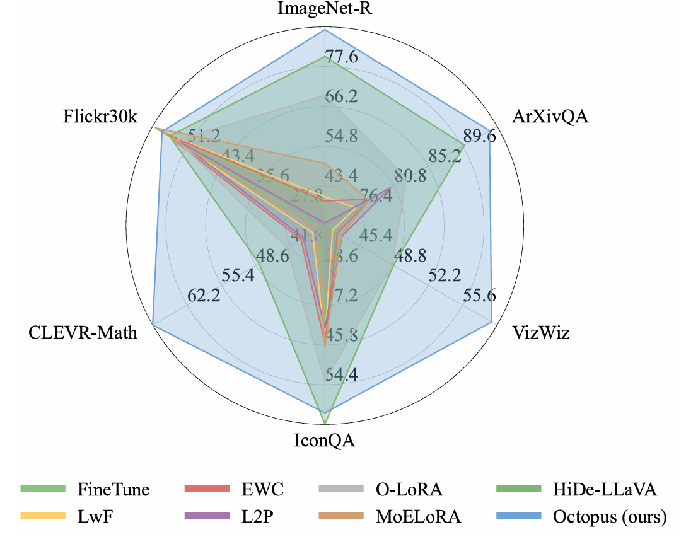

* **Figure 1 (방사형 레이더 그래프) 시각적 분포 분석:**
  * 레이더 그래프에서 가장 바깥쪽을 넓게 아우르는 파란색 선이 Octopus (ours)에 해당.
  * 기존 최강 성능이었던 녹색의 HiDe-LLaVA를 포함해 거의 모든 축(ImageNet-R, ArXivQA, CLEVR-Math 등)에서 압도적으로 큰 육각형을 그리며 SOTA 달성.

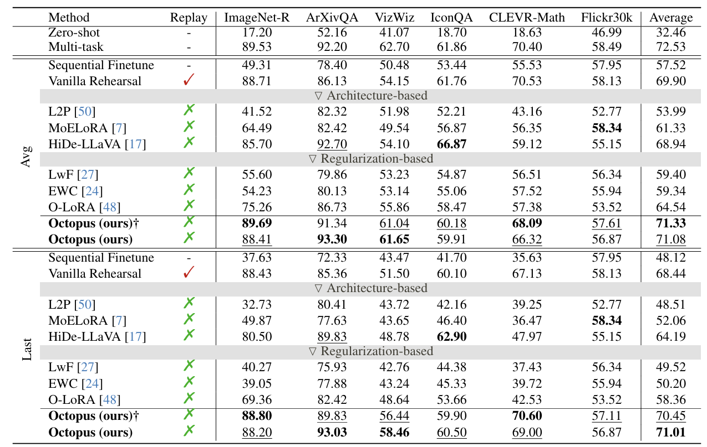

* **Table 1 수치적 비교 (Avg & Last):**
  * **기존 최고 모델 (HiDe-LLaVA):** Avg 68.94% / Last 64.19%
  * **제안 모델 (Octopus):** Avg 71.08% / Last 71.01%
  * **성능 향상 폭:** 이전 SOTA 모델 대비 평균 성능(Avg)에서 2.14%p, 최종 성능(Last)에서 6.82%p의 눈부신 성능 도약 달성.
  * **규제 기반 모델과의 비교:** 매개변수 공간 직교화에만 집중했던 기존 O-LoRA(Avg 64.54% / Last 58.36%)와 비교하면, Octopus는 Avg에서 6.54%p, Last에서 12.65%p나 앞서 있어 그래디언트 직교성의 뛰어난 성능 확인.
  * **Vanilla Rehearsal 방식 초월:**
    * 과거 데이터를 실제 메모리에 보관하면서 돌리는 Rehearsal 방식(Last 68.44%)보다도 과거 데이터를 아예 저장하지 않는 Octopus(Last 71.01%)가 오히려 더 우수한 성능 기록.
    * 이는 단순 forgetting 방지를 넘어 태스크 간 긍정적인 지식 전이(Positive Transfer)가 유도되었음을 의미.

#### 3. HiFGO의 수치적 증명 (Section 5.3 & Table 2)

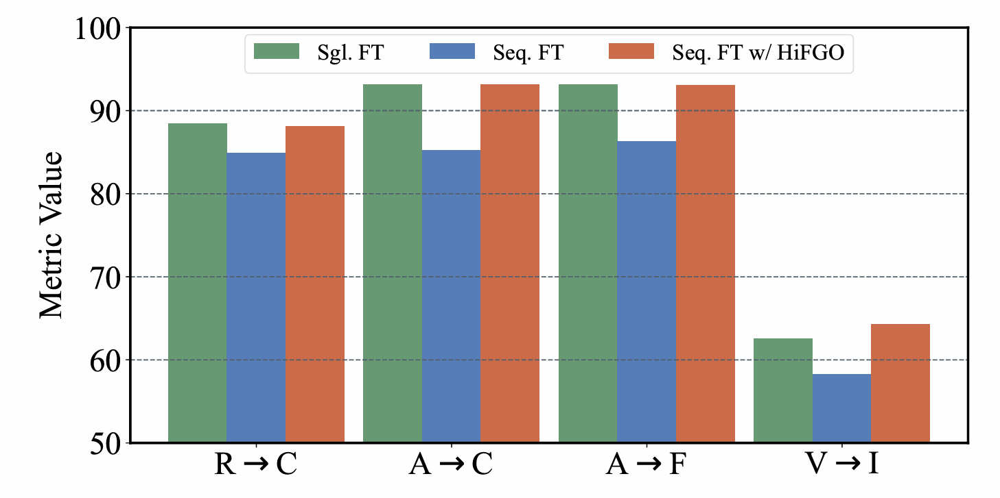

* **Figure 3 (HiFGO의 복구력) 분석:**
  * 2개의 태스크를 일반 순차 학습(Seq. FT, 파란색 바)하면 첫 번째 태스크의 성능이 급격히 저하되나, HiFGO 규제(Seq. FT w/ HiFGO, 주황색 바)를 적용해 정교하게 업데이트하면 단일 태스크만 학습했을 때(Sgl. FT, 녹색 바)의 성능 수준으로 고스란히 복구됨을 직관적으로 확인 가능.

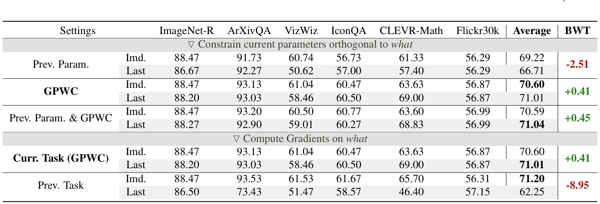

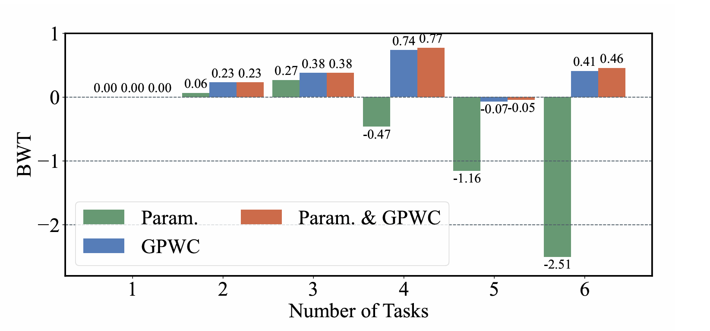

* **Table 2 & Figure 4 (직교 제약 대상 비교 - Param vs GPWC):**
  * 단순 파라미터 벡터에 직교할 때(Param.) 최종 평균 성능은 66.71%, 역전이 성능(BWT)은 -2.51로 상당한 망각 발생.
  * 반면 현재 데이터 하에서 이전 매개변수 감도를 계산한 그래디언트(GPWC)에 직교했을 때는 최종 평균 성능 **71.01%**로 도약하며, BWT 역시 +0.41로 **긍정적인 역전이(지식 향상)**가 발생하는 놀라운 결과 산출.

* **Table 2 하단 (현재 데이터 GPWC vs 과거 데이터 그래디언트):**
  * 과거 데이터를 그대로 사용해 직교하게 만드는 기존 방식(Prev. Task)은 BWT가 -8.95, 최종 성능이 **62.25%**로 오히려 성능이 대폭 망가짐.
  * 이는 수렴한 지점의 그래디언트가 미세하게 진동(Oscillatory)하기 때문이며, 현재 데이터로 과거 가중치를 테스트하는 GPWC 방식이 훨씬 신뢰할 수 있는 간섭 지침서가 된다는 사실을 과학적으로 증명.

#### 4. 2단계 미세조정과 가중치 세기 분석 (Table 3 & Table 4)

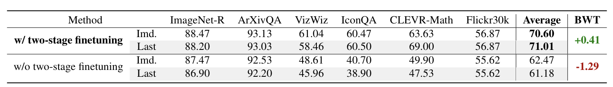

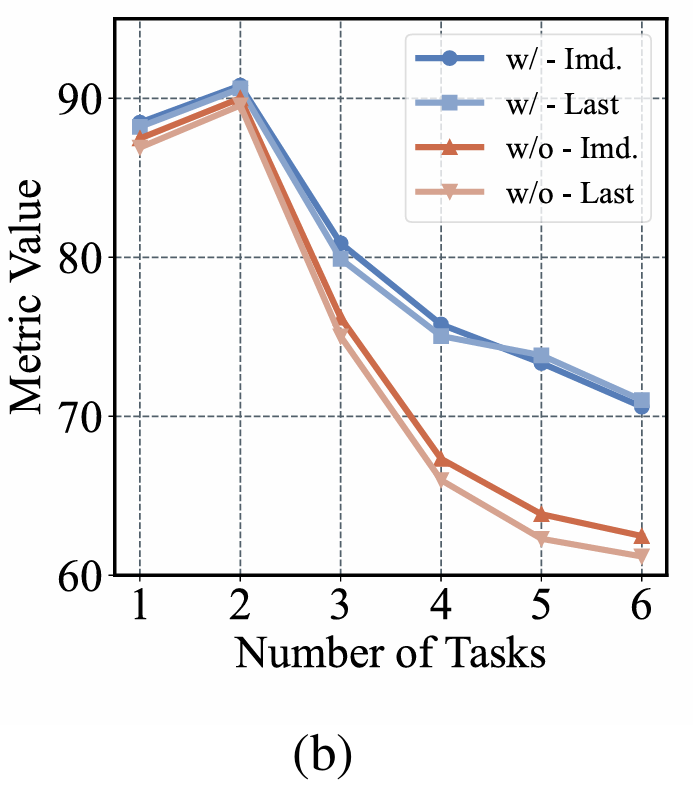

* **Table 3 & Figure 5b (2단계 미세조정 여부):**
  * 2단계 학습을 적용했을 때(w/) 최종 성능은 **71.01%**이나, 적용하지 않고 한 번에 규제를 걸고 학습했을 때(w/o)는 **61.18%**로 폭락.
  * **Figure 5b 그래프 분석:** 2단계를 사용하지 않는 경우(w/o - Last, 분홍색 실선) 태스크 3단계부터 학습 능력이 완전히 저하되어 최적화 한계에 부딪히는 양상 확인.

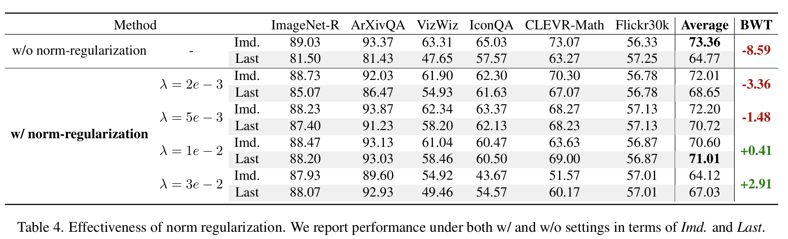

* **Table 4 (L2 규제 세기 $\lambda$ 조절):**
  * 규제가 아예 없으면($w/o\ norm$) 즉시 성능(Imd. 73.36%)은 높지만 망각 방지가 어려워 BWT는 -8.59로 붕괴.
  * 반대로 규제가 너무 세지면($\lambda = 3e^{-2}$) 망각은 완벽히 막지만(BWT +2.91) 새 태스크를 학습하는 능력(Imd. 64.12%)이 억제됨.
  * 이에 따라 가소성과 안정성의 최적 밸런스 지점으로 **$\lambda = 1e^{-2}$**를 선정.

#### 5. 태스크 순서에 대한 강건성 (Table 5 & Figure 5a)

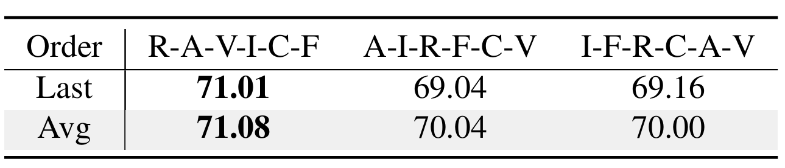

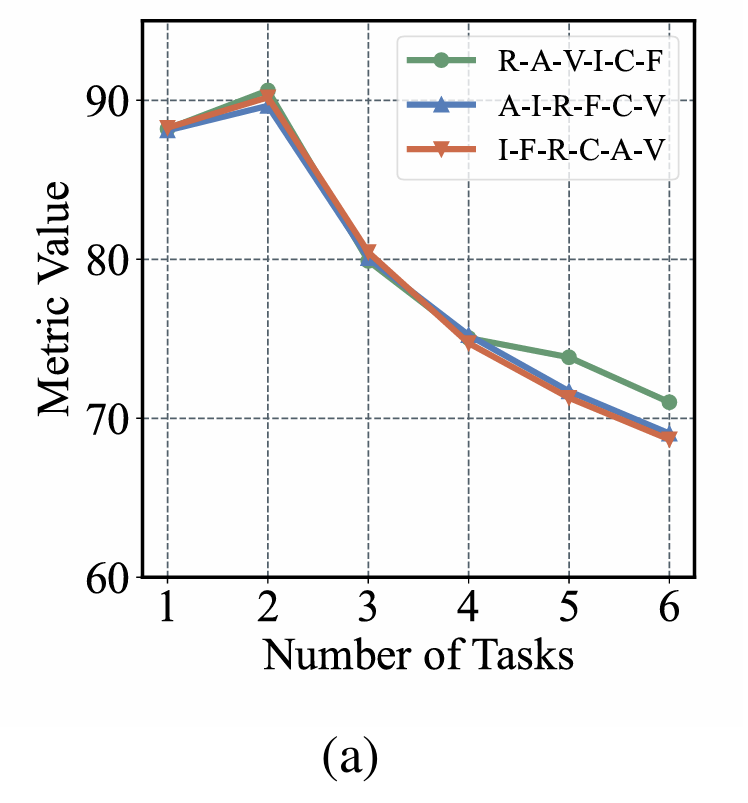

* **Table 5 결과 분석:**
  * 데이터셋 입력 순서를 다르게 변경하여 학습을 수행해도 결과 편차가 미미함:
    * R-A-V-I-C-F 순서: 최종 성능 71.01%
    * A-I-R-F-C-V 순서: 최종 성능 69.04%
    * I-F-R-C-A-V 순서: 최종 성능 **69.16%**

* **Figure 5a 그래프 분석:**
  * 세 가지 순서의 성능 하락 곡선이 완벽히 겹쳐져 있는 모습을 보임.
  * 학습 순서가 변경되더라도 편차 없이 일관되게 강력한 성능(Order-invariant Robustness)을 발휘함을 입증.� 배경:**
  * 4.1장의 테일러 전개 시 LoRA 매개변수의 극소 크기를 전제로 고차 잔여 항을 무시함.
  * 실제 학습 과정에서 가중치 증가에 따른 고차항 에러 누적 발생.
  * 이를 억제하기 위해 가중치 스케일을 제한하는 L2 규제 항($\mathcal{L}_{norm}$) 도입이 필수적임.

* **초기 규제 도입의 부작용 (성능 저하):**
  
  
  
  * 학습 초기부터 강한 규제 적용 시 미세조정 성능의 대폭 하락 관측.

* **성능 저하의 원인 분석:**
  1. 규제 제약으로 인한 매개변수 유효 Search Space의 축소.
  2. 본래 작업 학습 목적 함수($\mathcal{L}_{ce}$)와 anti-forgetting 규제 함수($\mathcal{L}_{orth}$, $\mathcal{L}_{norm}$) 간의 간섭으로 Suboptimal Local Minima에 수렴.

#### 2. STAGE 1: 제약 없는 자유 적응 (Stage-1 Finetuning)

* **작동 방식:** 모든 규제 제약($\mathcal{L}_{orth}$, $\mathcal{L}_{norm}$)을 비활성화하고, 현재 데이터 $\mathcal{D}_i$만으로 학습하여 로컬 최적 영역으로 자유롭게 이동.

* **손실 함수 (식 9):**
  $$\mathcal{L}_1 = \frac{1}{|\mathcal{D}_i|} \sum_{(x_k, y_k) \in \mathcal{D}_i} \mathcal{L}_{\text{ce}}(f_{\theta_{i,1}^\prime}(x_k), y_k)$$

#### 3. STAGE 2: 규제 하에 정교한 미세 조율 (Stage-2 Finetuning)

* **작동 방식:** 1단계에서 안착한 Optimal Manifold를 시작점으로 설정. 1단계 가중치 값을 초기값으로 삼고, HiFGO 규제($\mathcal{L}_{orth}$)와 가중치 스케일 규제($\mathcal{L}_{norm}$)를 활성화하여 미세조정 진행.

* **손실 함수 (식 10):**
  $$\mathcal{L}_2 = \frac{1}{|\mathcal{D}_i|} \sum_{(x_k, y_k) \in \mathcal{D}_i} \left( \mathcal{L}_{\text{ce}}(f_{\theta_{i,2}^\prime}(x_k), y_k) + \lambda_1 \mathcal{L}_{\text{orth}}(\theta_{i,2}) + \lambda_2 \mathcal{L}_{\text{norm}}(\theta_{i,2}) \right)$$

* **Figure 2 (STAGE 2)와의 관계:**
  * 보라색 HiFGO 모듈 활성화.
  * 현재 데이터(Data 1)와 이전 가중치들을 통해 구한 GPWC 방향 기반으로 현재 가중치($A_i, B_i$)에 직교 제약(Constraint)을 적용하여 업데이트 방향 조정.

#### 4. 실험으로 보는 2단계 전략의 파급력 (Figure 5b & Table 3)

* **Table 3 수치적 결과:**
  * 2단계 미세조정 적용 시(w/) 최종 평균 성능은 **71.01%**에 달하는 반면, 미적용 시(w/o) **61.18%**를 기록하여 약 **9.83%p의 심각한 성능 하락** 발생.

* **결론:** 2단계 전략이 규제 기반 지속 학습 모델의 고질적인 성능 한계(성능 천장)를 획기적으로 극복한 핵심 열쇠임을 증명.

### Experiments

#### 1. 실험 환경 (Experimental Setup)

* **벤치마크 (UCIT):** MLLM의 실질적인 지속 학습 능력을 평가하기 위해 고안된 벤치마크. 다음의 6가지 고유한 도메인과 데이터셋이 순차적으로 모델에 입력되어 도메인 변화와 Catastrophic Forgetting 유도:
  * **ImageNet-R:** 이미지 분류 영역
  * **ArXivQA:** 학술 QA 영역
  * **VizWiz:** 시각적 질문 답변(VQA) 영역
  * **IconQA:** 아이콘 인식 및 QA 영역
  * **CLEVR-Math:** 수학적 추론 영역
  * **Flickr30k:** 이미지 캡셔닝 영역

* **주요 평가 지표 (Metrics):**
  * **Last (최종 정확도):** 모든 6개 태스크를 순차적으로 다 학습한 직후 측정하는 전체 태스크의 평균 정확도 (가장 핵심적인 지표).
  * **Avg (평균 정확도):** 학습 단계마다 수행된 성능들의 평균값.
  * **Imd. (즉시 정확도):** 특정 태스크를 학습한 바로 직후에 측정된 성능으로, 해당 태스크가 도달할 수 있는 사실상의 성능 상한선(Upper Bound)을 의미.
  * **BWT (Backward Transfer, 역전이):** 이전 태스크들의 성능 저하(forgetting 정도)를 보여주며, **양이 될수록 성능이 오히려 향상(Positive Transfer)**되었음을 의미.

#### 2. 메인 결과 (Main Results) - SOTA의 경신

* **Figure 1 (방사형 레이더 그래프) 시각적 분포 분석:**
  * 레이더 그래프에서 가장 바깥쪽을 넓게 아우르는 파란색 선이 Octopus (ours)에 해당.
  * 기존 최강 성능이었던 녹색의 HiDe-LLaVA를 포함해 거의 모든 축(ImageNet-R, ArXivQA, CLEVR-Math 등)에서 압도적으로 큰 육각형을 그리며 SOTA 달성.

* **Table 1 수치적 비교 (Avg & Last):**
  * **기존 최고 모델 (HiDe-LLaVA):** Avg 68.94% / Last 64.19%
  * **제안 모델 (Octopus):** Avg 71.08% / Last 71.01%
  * **성능 향상 폭:** 이전 SOTA 모델 대비 평균 성능(Avg)에서 2.14%p, 최종 성능(Last)에서 6.82%p의 눈부신 성능 도약 달성.
  * **규제 기반 모델과의 비교:** 매개변수 공간 직교화에만 집중했던 기존 O-LoRA(Avg 64.54% / Last 58.36%)와 비교하면, Octopus는 Avg에서 6.54%p, Last에서 12.65%p나 앞서 있어 그래디언트 직교성의 뛰어난 성능 확인.
  * **Vanilla Rehearsal 방식 초월:**
    * 과거 데이터를 실제 메모리에 보관하면서 돌리는 Rehearsal 방식(Last 68.44%)보다도 과거 데이터를 아예 저장하지 않는 Octopus(Last 71.01%)가 오히려 더 우수한 성능 기록.
    * 이는 단순 forgetting 방지를 넘어 태스크 간 긍정적인 지식 전이(Positive Transfer)가 유도되었음을 의미.

#### 3. HiFGO의 수치적 증명 (Section 5.3 & Table 2)

* **Figure 3 (HiFGO의 복구력) 분석:**
  * 2개의 태스크를 일반 순차 학습(Seq. FT, 파란색 바)하면 첫 번째 태스크의 성능이 급격히 저하되나, HiFGO 규제(Seq. FT w/ HiFGO, 주황색 바)를 적용해 정교하게 업데이트하면 단일 태스크만 학습했을 때(Sgl. FT, 녹색 바)의 성능 수준으로 고스란히 복구됨을 직관적으로 확인 가능.

* **Table 2 & Figure 4 (직교 제약 대상 비교 - Param vs GPWC):**
  * 단순 파라미터 벡터에 직교할 때(Param.) 최종 평균 성능은 66.71%, 역전이 성능(BWT)은 -2.51로 상당한 망각 발생.
  * 반면 현재 데이터 하에서 이전 매개변수 감도를 계산한 그래디언트(GPWC)에 직교했을 때는 최종 평균 성능 **71.01%**로 도약하며, BWT 역시 +0.41로 **긍정적인 역전이(지식 향상)**가 발생하는 놀라운 결과 산출.

* **Table 2 하단 (현재 데이터 GPWC vs 과거 데이터 그래디언트):**
  * 과거 데이터를 그대로 사용해 직교하게 만드는 기존 방식(Prev. Task)은 BWT가 -8.95, 최종 성능이 **62.25%**로 오히려 성능이 대폭 망가짐.
  * 이는 수렴한 지점의 그래디언트가 미세하게 진동(Oscillatory)하기 때문이며, 현재 데이터로 과거 가중치를 테스트하는 GPWC 방식이 훨씬 신뢰할 수 있는 간섭 지침서가 된다는 사실을 과학적으로 증명.

#### 4. 2단계 미세조정과 가중치 세기 분석 (Table 3 & Table 4)

* **Table 3 & Figure 5b (2단계 미세조정 여부):**
  * 2단계 학습을 적용했을 때(w/) 최종 성능은 **71.01%**이나, 적용하지 않고 한 번에 규제를 걸고 학습했을 때(w/o)는 **61.18%**로 폭락.
  * **Figure 5b 그래프 분석:** 2단계를 사용하지 않는 경우(w/o - Last, 분홍색 실선) 태스크 3단계부터 학습 능력이 완전히 저하되어 최적화 한계에 부딪히는 양상 확인.

* **Table 4 (L2 규제 세기 $\lambda$ 조절):**
  * 규제가 아예 없으면($w/o\ norm$) 즉시 성능(Imd. 73.36%)은 높지만 망각 방지가 어려워 BWT는 -8.59로 붕괴.
  * 반대로 규제가 너무 세지면($\lambda = 3e^{-2}$) 망각은 완벽히 막지만(BWT +2.91) 새 태스크를 학습하는 능력(Imd. 64.12%)이 억제됨.
  * 이에 따라 가소성과 안정성의 최적 밸런스 지점으로 **$\lambda = 1e^{-2}$**를 선정.

#### 5. 태스크 순서에 대한 강건성 (Table 5 & Figure 5a)

* **Table 5 결과 분석:**
  * 데이터셋 입력 순서를 다르게 변경하여 학습을 수행해도 결과 편차가 미미함:
    * R-A-V-I-C-F 순서: 최종 성능 71.01%
    * A-I-R-F-C-V 순서: 최종 성능 69.04%
    * I-F-R-C-A-V 순서: 최종 성능 **69.16%**

* **Figure 5a 그래프 분석:**
  * 세 가지 순서의 성능 하락 곡선이 완벽히 겹쳐져 있는 모습을 보임.
  * 학습 순서가 변경되더라도 편차 없이 일관되게 강력한 성능(Order-invariant Robustness)을 발휘함을 입증.