<!-- _class: lead -->

# Continual Learning Survey
## From Traditional Methods to Pre-Trained & Vision-Language Models

De Lange et al. (TPAMI 2021) · Zhou et al. (2024) · Liu et al. (2025)

2026.07.10

Hyuntaek Seo

---

## Agenda

1. **Continual Learning: Problem Definition**
2. **Traditional CL Methods** — De Lange et al. (TPAMI 2021)
3. **PTM-based CL** — Zhou et al. (2024)
4. **VLM-based CL** — Liu et al. (2025)
5. **Cross-Survey Comparison & Future Directions**

---

<!-- _class: lead -->

# Part I: Problem Definition

Continual Learning Fundamentals

---

## What is Continual Learning?

### Problem
- Data arrives **sequentially** as a stream of tasks
- Previous data is **inaccessible** (privacy, storage)
- Must learn new knowledge while **retaining old knowledge**

### Core Challenge: Catastrophic Forgetting
- Learning new tasks drastically degrades old task performance
- **Stability-Plasticity Dilemma**:
  - Stability = retain prior knowledge
  - Plasticity = absorb new knowledge

$$f^* = \arg\min_{f \in \mathcal{H}} \mathbb{E}_{(x,y) \sim D_1 \cup \cdots \cup D_B} \mathbb{I}(y \neq f(x))$$

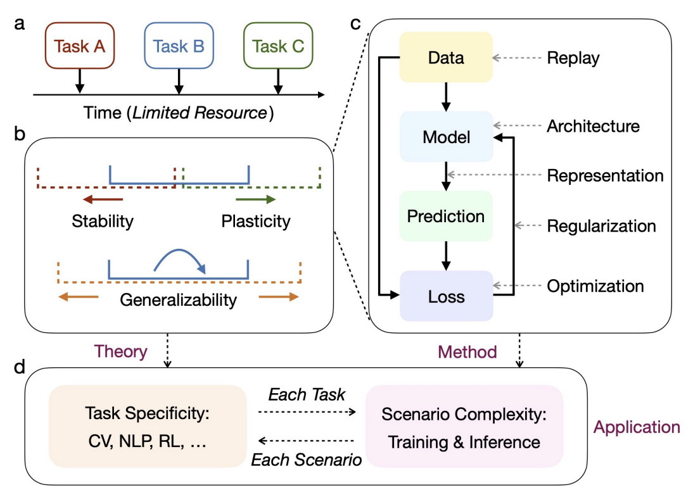

---

## CL Variations

| Setting | Training | Test | Difficulty |
|:---:|---|---|:---:|
| **CIL** (Class-Incremental) | New classes per task, $Y_b \cap Y_{b'} = \emptyset$ | No task ID — classify among **all** classes | **Hard** |
| **TIL** (Task-Incremental) | New classes per task, $Y_b \cap Y_{b'} = \emptyset$ | Task ID provided — classify within task | Medium |
| **DIL** (Domain-Incremental) | Same classes, domain shift | Same label space across tasks | Easy |

> **CIL is the dominant setting** in modern CL research — most practical and challenging.

---

<!-- _class: lead -->

# Part II: Traditional CL Methods

De Lange et al., <em>"A Continual Learning Survey"</em> (TPAMI 2021)

---

## Traditional CL: Taxonomy

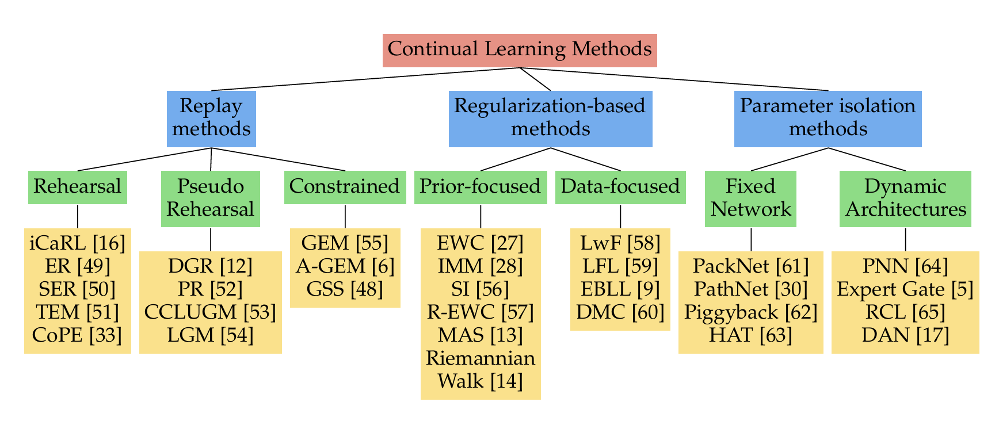

**1. Replay Methods**
- Rehearsal *(iCaRL, GEM)*

**2. Regularization-based Methods**
- Prior-focused *(EWC, SI, MAS)*
- Data-focused *(LwF, EBLL)*

**3. Parameter Isolation Methods**
- Fixed Network *(PackNet, HAT)*
- Dynamic Architecture *(PNN, Expert Gate)*

---

## Replay Methods: Rehearsal

### Core Concept
- Store a subset of past data in a **memory buffer** (exemplars)
- Replay stored samples alongside new task data

### Methods
- **iCaRL**: Nearest-class-mean classifier + knowledge distillation
- **GEM**: Constrain gradient to not increase past task losses (QP solver)
- **A-GEM**: Lightweight GEM — uses average past gradient

---

## Deep Dive: iCaRL (CVPR 2017)
### Incremental Classifier and Representation Learning

### Key Components
1. **Nearest-Class-Mean (NCM) Classifier**:
   - Classification is done by computing class prototype $\mu_c$ (average feature representation of exemplars of class $c$) 
   - assigning sample $x$ to the nearest prototype:
     $$y^* = \arg\min_c \|\Phi(x) - \mu_c\|_2$$
2. **Exemplar Selection (Herding)**:
   - Iteratively selects exemplars such that their average feature vector best approximates the true class mean.

### Loss Formulation
- Uses binary cross-entropy (BCE) to train features:
  $$\mathcal{L} = \mathcal{L}_{CE} \text{ (new tasks)} + \mathcal{L}_{dist} \text{ (old tasks)}$$
- Distillation loss uses previous model's output logits as soft targets.

---

## Regularization-based Methods

> **Core idea**: Add a penalty term to the loss to prevent important parameters or outputs from changing too much.
> $$\mathcal{L} = \mathcal{L}_{new} + \lambda \cdot \mathcal{L}_{reg}$$

### 1. Prior-focused (Parameter Importance)
*What to regularize: **weights***

- **EWC**: $\mathcal{L}_{reg} = \sum_i F_i (\theta_i - \theta_i^*)^2$ (Fisher Information)
- **SI**: Importance accumulated **online** during training
- **MAS**: Importance via **unsupervised gradients** of outputs

### 2. Data-focused (Knowledge Distillation)
*What to regularize: **outputs***

- **LwF**: $\mathcal{L}_{reg} = \text{KL}(p_{old}(x) \| p_{new}(x))$ on new task data
- **EBLL**: Constrains features in **low-dimensional projection space**
- **IMM**: Merges **Gaussian posteriors** of task networks

---

## Deep Dive: EWC (PNAS 2017) — Representative Prior-focused Method

### Quadratic Parameter Penalty
- EWC constrains parameters to stay close to the optimal parameters of past tasks $\theta_A^*$.
- The constraint is weighted by the **Fisher Information Matrix (FIM)**, which measures parameter sensitivity.

$$\mathcal{L}(\theta) = \mathcal{L}_{new}(\theta) + \sum_{k < t} \frac{\lambda}{2} \sum_i F_{k,i} (\theta_i - \theta_{k,i}^*)^2$$

### Fisher Information Matrix (FIM)
- The diagonal entries $F_i$ represent the importance of weight $\theta_i$:
  $$F_i = \mathbb{E} \left[ \left( \frac{\partial \log p(y|x; \theta^*)}{\partial \theta_i} \right)^2 \right]$$
- Approximates the curvature of the loss surface.
- **Limitation**: Requires storing FIM and weight vectors for all past tasks (linear storage growth), though *Online EWC* aggregates them.

---

## Deep Dive: LwF (ECCV 2016) — Representative Data-focused Method

### Mechanism
- Uses **only new task data** $X_n$ for both new task learning and old task preservation.
- Passes $X_n$ through the previous model to get predictions $Y_o$ (soft labels) for old tasks.
- Trains the model to minimize cross-entropy on new tasks and distillation loss on old tasks.

### Loss Formulation
$$\mathcal{L} = \mathcal{L}_{new}(Y_n, \hat{Y}_n) + \lambda \mathcal{L}_{dist}(Y_o, \hat{Y}_o)$$
- Distillation loss $\mathcal{L}_{dist}$ utilizes temperature-scaled softmax cross-entropy.

### Limitations
- **Domain Shift**: Highly sensitive to the relation between tasks. If $X_n$ is very different from $X_o$, the distillation on $X_n$ fails to protect old task knowledge.

---

## Parameter Isolation Methods

> **Core idea**: Assign dedicated parameters per task — no interference by design.
> $$\theta = \bigcup_{t=1}^{T} \theta_t, \quad \theta_i \cap \theta_j = \emptyset \;\; (i \neq j)$$

### 1. Fixed Network (Masking)
*Allocate subsets within a fixed-size network*

- **PackNet**: Prune → freeze binary mask $m_t$ per task
- **HAT**: Learn attention masks on layers to protect old activations

> Capacity is bounded — performance degrades as tasks accumulate

### 2. Dynamic Architecture (Expansion)
*Add new modules per task*

- **PNN**: New column per task, freeze old columns
- **Expert Gate**: Autoencoder gate routes inputs to task-specific expert

> No capacity limit, but model size grows linearly with tasks

---

## Traditional CL: Experimental Setup

### Experimental Setting
- **Scenario**: Task-Incremental Learning (TIL) using a multi-head architecture (Oracle task ID provided at test time).
  - Parameter Isolation methods (PackNet, HAT) structurally require task ID → TIL chosen for **fair comparison** across all 11 methods

- **Model Architectures**:
  - *Tiny ImageNet*: VGG-based models (SMALL, BASE, WIDE, DEEP) to analyze capacity effects.
  - *iNaturalist*: Pre-trained AlexNet backbone.
- **Hyperparameter Framework**: Dynamic tuning using only current task data (Maximal Plasticity Search & Stability Decay).

### Evaluated Benchmarks
- **Tiny ImageNet**: Balanced small-scale. 
- **iNaturalist**: Unbalanced large-scale. 
- **Baselines**: Finetuning (lower bound) & Joint Training (upper bound).
- **Metrics**: Average Accuracy & Average Forgetting.

---

## Traditional CL: Experimental Results (TIL Setting)

> All results under **TIL** (task ID given at test time) — not directly comparable to CIL benchmarks

| Method | Family | Tiny ImageNet (Avg Acc / Forget) | iNaturalist (Random) (Avg Acc / Forget) | Key Significance / Behavior |
|:---|:---:|:---:|:---:|:---|
| **Joint\*** | Upper Bound | 55.70% / 0.00% | 63.90% / — | Multi-task upper bound reference |
| **PackNet** | Isolation | **49.13% / 0.00%** | **60.61% / 0.00%** | **Best overall performance**; zero forgetting via pruning |
| **iCaRL** | Replay | 48.76% / -1.76% | — | Achieves **backward transfer** (negative forgetting) |
| **MAS** | Regularization | 46.90% / 1.58% | 54.59% / 4.97% | Robust regularization; insensitive to hyperparameters |
| **EWC** | Regularization | 42.43% / 7.51% | 54.02% / 6.67% | Standard prior regularization baseline |
| **LwF** | Regularization | 41.91% / 3.08% | 45.39% / 13.77% | Suffers high forgetting under domain imbalance |
| **SI** | Regularization | 33.93% / 15.77% | 47.54% / 13.85% | Overfits on small scale, stabilized by large scale data |
| **Finetuning** | Lower Bound | 21.30% / 26.90% | 45.59% / 17.02% | Naive sequential finetuning lower bound |

---

## Traditional CL: Key Observations & Deep Dives

### 1. Key Insights from Results
- **Isolation Dominance**: **PackNet** outperforms all methods by freezing weights via pruning (zero forgetting).
- **iCaRL's Backward Transfer**: NCM classifier enables negative forgetting (improving past tasks).
- **Domain Gap & Scaling**: Regularization methods (EWC, MAS) scale better on iNaturalist but struggle on out-of-distribution data.

### 2. Capacity & Regularization Trends
- **WIDE > DEEP**: Shallow and wide models outperform deep models (VGG) by ~11% accuracy.
- **Regularization**: Dropout dramatically stabilizes SI (+10%) and PackNet (reaches 55.96%), but hurts iCaRL.

---

<!-- _class: lead -->

# Part III: PTM-based Continual Learning

Zhou et al., <em>"Continual Learning with Pre-Trained Models"</em> (2024)

---

## Why Pre-Trained Models?

### Paradigm Shift in CL
- Training from scratch causes **severe catastrophic forgetting**.
- Pre-trained representations **stabilize the feature space**.

### Two Key Insights from PTMs

1. **Generalizability**: PTMs already possess strong representations for downstream tasks.
2. **Lightweight Tuning**: Prompts/Adapters enable efficient adaptation while preserving knowledge.

  

    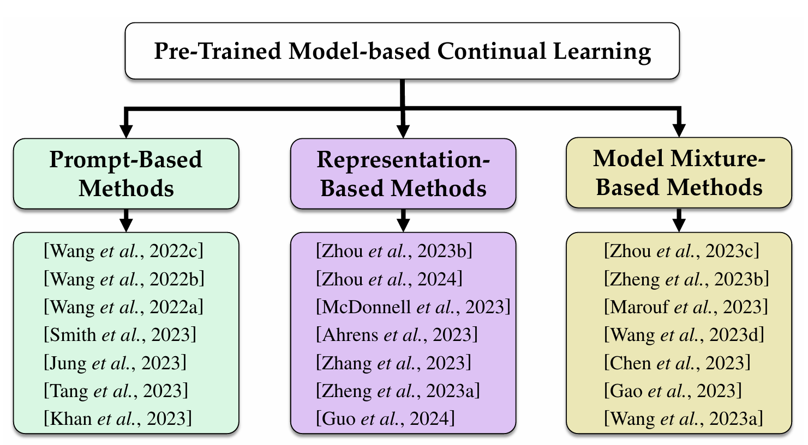
  

  

    Zhou et al., 2024: Taxonomy of PTM-based CL
  

---

## Prompt-based Methods

### Core Idea
Freeze PTM, learn lightweight **prompts** $P \in \mathbb{R}^{p \times d}$

### Prompt Selection Strategies

- **L2P** (`Query-Key Matching`) 
Retrieve from shared prompt pool
- **DualPrompt** (`General + Expert`) 
Decoupled at different layers
- **CODA-Prompt** (`Attention-Weighted`) 
Combine prompt components
- **DAP** (`MLP Generator`)
Instance-specific prompt generation

  

    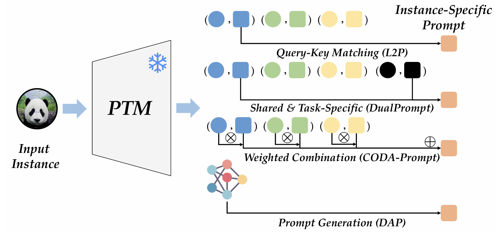
  

  

    Zhou et al., 2024: Prompt Selection Strategies
  

---

## Representation-based Methods (1/2)

### SimpleCIL (Frozen Baseline)
- Compute class prototypes (NCM):
  $$c_i = \frac{1}{K}\sum_{j} \mathbb{I}(y_j = i) \cdot \phi(x_j)$$

### ADAM (Feature Concatenation)
- Concatenate frozen & adapted features:
  $$f_{concat} = [f_{frozen} \,;\, f_{adapted}]$$

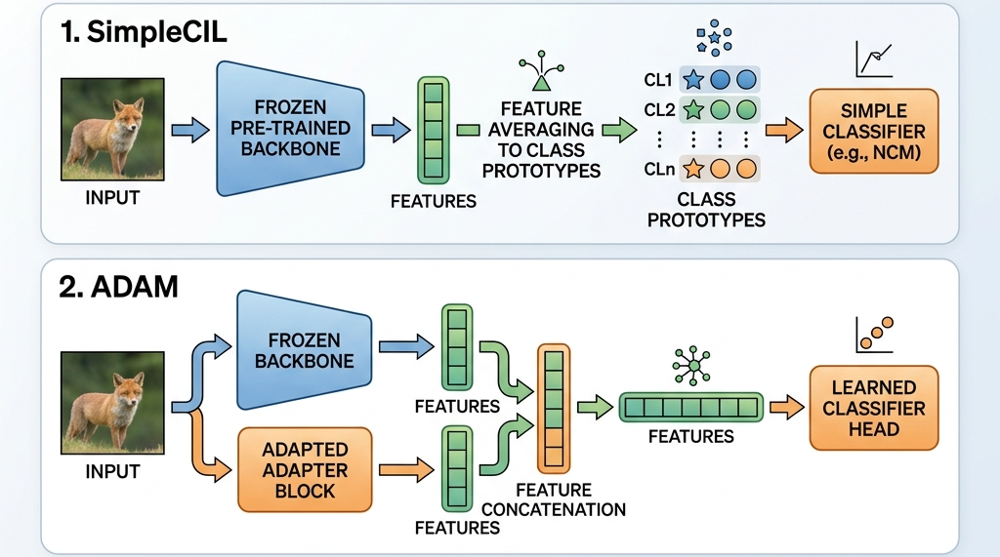
_Zhou et al., 2024: Representation-based CL Architectures_

---

## Representation-based Methods (2/2)

### RanPAC (`Random Projection`)
- **Projection**: Random projection layer:
  $$x_{proj} = W_{rand} \cdot \phi(x) \quad (W_{rand} \in \mathbb{R}^{K \times d})$$
- **LDA Classifier**: Trains online LDA in high-dimensional space

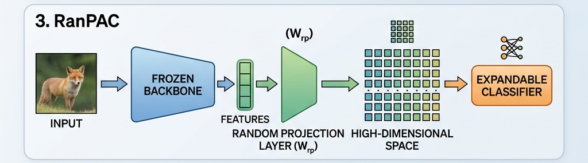

### EASE (`Expandable Adapter`)
- Adds a lightweight **adapter subspace** $A_t$ per task
- Final feature = concatenation of all adapted features:
  $$f = [A_1(\phi(x)) \,;\, A_2(\phi(x)) \,;\, \cdots \,;\, A_t(\phi(x))]$$
- Backbone stays frozen — only adapters are trained

---

## Model Mixture-based Methods

### Model Ensemble
- **Core Concept**: Trains task-specific models (or heads) based on a shared PTM backbone.
- **ESN** (`Task Heads`) — Initializes a new head for each task and votes via max logit during inference.

### Model Merging
- **Core Concept**: Combines multiple distinct models into a single parameter space:
  $$\theta_{merge} = \alpha \cdot \theta_{old} + (1-\alpha) \cdot \theta_{new}$$

  

    <strong style="color: #2d3436; font-size: 20px;">LAE</strong> <code style="font-size: 14px; background: #e2e8f0; color: #475569; padding: 2px 6px; border-radius: 4px; vertical-align: middle;">Interpolation</code> 
    Linear weight interpolation between online & offline models.
  

  

    <strong style="color: #2d3436; font-size: 20px;">ZSCL</strong> <code style="font-size: 14px; background: #e2e8f0; color: #475569; padding: 2px 6px; border-radius: 4px; vertical-align: middle;">Frequent Merge</code> 
    Merges model parameters every few training iterations (for CLIP).
  

  

    <strong style="color: #2d3436; font-size: 20px;">CoFiMA</strong> <code style="font-size: 14px; background: #e2e8f0; color: #475569; padding: 2px 6px; border-radius: 4px; vertical-align: middle;">Fisher Weighted</code> 
    Weighs parameter merging based on Fisher information matrix.
  

  

    <strong style="color: #2d3436; font-size: 20px;">HiDe-Prompt</strong> <code style="font-size: 14px; background: #e2e8f0; color: #475569; padding: 2px 6px; border-radius: 4px; vertical-align: middle;">Prompt Merge</code> 
    Merges prompt weights sequentially after each learning stage.
  

---

## PTM-based CL: Experimental Setup

### Experimental Environment
- **Backbone**: **ViT-B/16-IN21K** (Strong representation power, pre-trained on ImageNet21K).
- **Dataset Split**: **'B-m, Inc-n' protocol** (first task $m$ classes, subsequent tasks $n$ classes). Shuffled with a fixed seed.
- **Metrics**:
  - **Last Stage Accuracy** ($A_B$): Final evaluation on all seen tasks.
  - **Average Accuracy** ($\bar{A} = \frac{1}{B}\sum_{b=1}^{B} A_b$): Average of accuracies across incremental stages.

### Benchmark Datasets
- **Typical CL**: CIFAR100, CUB200
- **Large Domain Gap** (Severe shift from ImageNet):
  ImageNet-R, ImageNet-A, ObjectNet, OmniBenchmark, VTAB.

### Evaluated Methods (9 Baselines)
- **Prompt-based**: L2P, DualPrompt, CODA-Prompt, DAP
- **Representation-based**: SimpleCIL, ADAM, RanPAC, EASE
- **Model Mixture-based**: ESN, HiDe-Prompt

---

## PTM-based CL: Experimental Results (1/2)

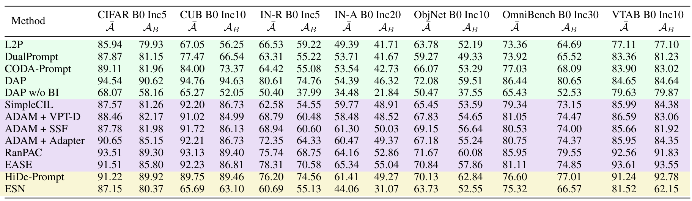

### Key Findings
- **Domain gap matters**: CIFAR100 → high accuracy, ImageNet-A/R → significant drop
- **Representation-based > Prompt-based**: RanPAC, EASE, ADAM consistently SOTA

---

## PTM-based CL: Experimental Results (2/2)

### Key Findings (Part 2)
- **SimpleCIL** (frozen + NCM) > L2P, DualPrompt
- Complex prompting can **introduce noise**

### DAP Fairness Issue
- DAP uses batch context / BI (Batch Information: using batch statistics instead of independent inference)
  ➔ **Leaks task identity** (violates CL protocol)
- Without BI: up to **-30% accuracy drop**

| Dataset | DAP (Cheating) | DAP w/o BI | Gap |
|---|:---:|:---:|:---:|
| **CIFAR100** | 94.54% | **68.07%** | **-26.47%** |
| **CUB200** | 94.76% | **65.27%** | **-29.49%** |
| **IN-R** | 80.61% | **50.40%** | **-30.21%** |
| **IN-A** | 54.39% | **34.48%** | **-19.91%** |

---

<!-- _class: lead -->

# Part IV: VLM-based Continual Learning

Liu et al., <em>"Continual Learning for VLMs"</em> (2025)

---

## VLM-CL: Why is it Different?

### Vision-Language Models
- **Dual-encoder**: CLIP, ALIGN, SigLIP
- **Generative MLLM**: LLaVA, Qwen-VL, MiniGPT-4

### Challenges

1. **Cross-Modal Feature Drift** — image-text alignment desynchronizes after fine-tuning
2. **Shared Module Interference** — cross-attention layers get overwritten by new tasks
3. **Zero-Shot Erosion** — broad generalization manifold compressed to narrow task scope

  

    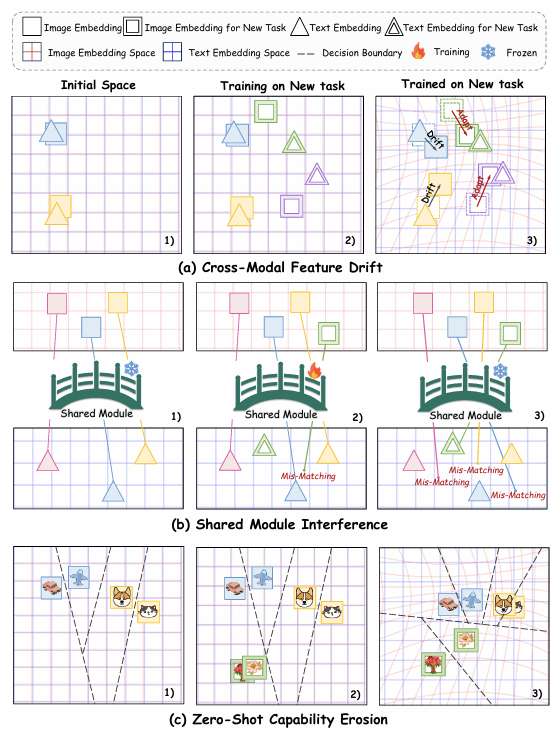
  

  

    [Liu et al., 2025] Figure 2: Three core challenges in VLM-CL
  

---

## VLM-CL: Target Models & Approach

### CLIP (Dual-Encoder)

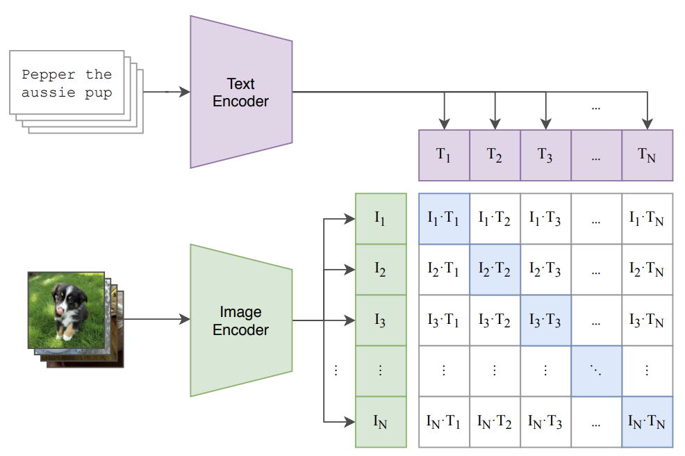

- Image encoder + Text encoder
- Contrastive alignment

### LLaVA (Generative MLLM)

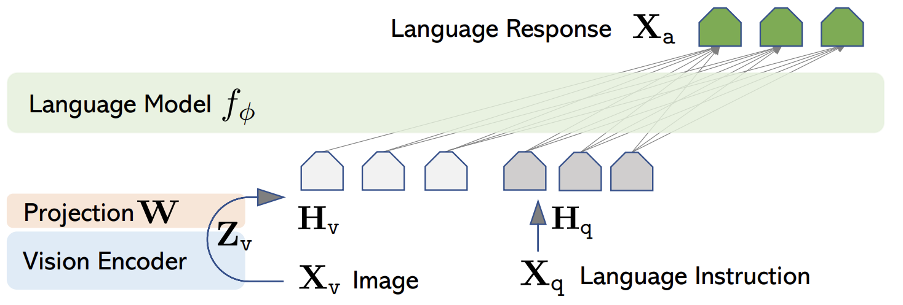

- Vision encoder + LLM
- Cross-attention / projection

### Two Paradigms

**CFT** (Dominant)
- Freeze backbone + PEFT
- Most current research

**CPT** (Emerging)
- Update at pre-training scale
- Early-stage exploration

---

## VLM-CL: Taxonomy

  

    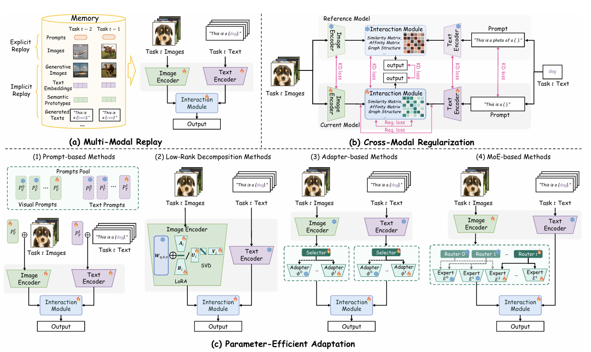
  

  

    [Liu et al., 2025] Figure 4: Detailed VLM-CL method architectures
  

### Four Paradigms

**1. Multi-Modal Replay (MREP)**
- Explicit / Implicit memory

**2. Cross-Modal Regularization (CREG)**
- KD / Alignment Maintenance / Guided Reg.

**3. Parameter-Efficient Adaptation (PEA)**
- Adapter / LoRA / MoE / Prompt

**4. Model Fusion & Decoupling** (emerging)

---

## Multi-Modal Replay (MREP)

### Explicit Replay
- Store raw **image-text pairs** from previous tasks
- High accuracy, but high storage & privacy cost
- Must replay **both modalities** simultaneously

### Implicit Replay
- **Semantic Prototypes**: store class-wise feature centroids
- **Generated Texts**: LLM synthesizes descriptive text
- **Synthetic Images**: generative model creates representative samples

### Explicit vs. Implicit

| | **Explicit** | **Implicit** |
|:---|:---:|:---:|
| **Accuracy** | High | Approximate |
| **Storage** | Heavy | Light |
| **Privacy** | Risk | Safe |
| **Trend** | ← | **→ Preferred** |

---

## Cross-Modal Regularization (CREG)

### Knowledge Distillation
- **DualTeacher**: Freeze text encoder, align image encoder with pre-trained + latest teacher
$$\mathcal{L}_{KD}^{dual} = \sum_{x} \eta(x) \cdot \mathcal{L}_{KD}^{t-1} + (1-\eta(x)) \cdot \mathcal{L}_{KD}^{0}$$
- **SCD**: Counterfactual to prevent language shortcuts
- **AwoForget**: Preserve cross-modal graph proximity

### Alignment Maintenance
| Method | Strategy |
|---|---|
| **ZSCL** | Preserve cross-modal similarity distribution |
| **DKR** | Dynamic vision-language affinity matrix |
| **Mod-X** | Regularize off-diagonal similarity |
| **MG-CLIP** | Preserve modality gap during training |
| **GNSP** | Null-space gradient projection |

### Guided Regularization
- **RAPF**: Text similarity identifies related old classes → enforce visual separation

---

## Parameter-Efficient Adaptation (PEA) — 1/2

### Adapter-based
- Insert lightweight bottleneck modules into frozen backbone:

$$h = W_{up} \cdot \sigma(W_{down} \cdot x) + x$$

- $W_{down} \in \mathbb{R}^{r \times d}$, $W_{up} \in \mathbb{R}^{d \times r}$ where $r \ll d$
- **Orthogonal constraint** prevents task interference:
  $$W_{down}^{(t)T} \cdot W_{down}^{(i)} = 0 \quad \forall i < t$$
- Methods: CLAP4CLIP, ATLAS, RAIL, TAM

### Low-Rank Adaptation (LoRA variants)
- Decompose weight update as low-rank product:

$$\Delta W = B \cdot A, \quad B \in \mathbb{R}^{d \times r},\; A \in \mathbb{R}^{r \times d}$$

$$W' = W_{frozen} + \Delta W$$

- Same orthogonal constraint applied to $A$ matrices across tasks
- Methods: O-LoRA, N-LoRA, CoDyRA, DIKI, LW2G

---

## Parameter-Efficient Adaptation (PEA) — 2/2

### MoE-based (Mixture of Experts)
- Router $g$ selects expert modules per input:

$$y_t = \sum_{i=1}^{N_E} g_i(x_t) \cdot E_i(x_t), \quad \sum_i g_i = 1$$

- Each expert $E_i$ is a lightweight adapter/LoRA — new tasks add experts without overwriting old ones
- Methods: MoE-Adapters, HiDe-LLaVA

### Prompt-based
- Prepend learnable tokens $P_t \in \mathbb{R}^{L \times d}$ to input sequence:

$$Z = [P_t \,;\, X] \cdot W_{attn}$$

- Frozen backbone + only $P_t$ is updated per task
- Cross-modal variant: separate $P_t^{img}$, $P_t^{txt}$ for each modality
- Methods: S-liPrompt, CPE-CLIP, LPI, CoLeCLIP

---

## VLM-CL: Experimental Setup

### Research Questions
> When learning sequential tasks via PEFT on a frozen CLIP backbone:

1. **Classification**: Can PEA outperform traditional CL (LwF, EWC)?
2. **Retrieval**: Can cross-modal alignment be preserved?
3. **VQA**: Does compositional reasoning collapse?

- **Backbone**: CLIP (ViT-B/16)
- **Methods**: MREP / CREG / PEA / Model Fusion

### Benchmarks

- **Classification** — MTIL (438K images, 10 datasets, CIL/TIL)
- **Retrieval** — Flickr30K + MS-COCO (image-text pair matching, R@1)
- **VQA** — VQACL (~100K QA, concept-relation separation)

---

## VLM-CL: Image Classification Results (MTIL Benchmark)

> *Transfer = zero-shot accuracy on unseen tasks (higher = less erosion of pre-trained generalization)*

| Method | Category | Transfer | Avg. | Last |
|:---|:---:|:---:|:---:|:---:|
| **Zero-shot CLIP** | Baseline | 69.4% | 65.3% | 65.3% |
| **Continual FT** | Lower Bound | 44.6% | 55.9% | 77.3% |
| LwF | Traditional | 56.9% | 64.7% | 74.6% |
| MoE-Adapter | PEA (MoE) | 68.9% | 76.7% | 85.0% |
| **Dual-RAIL** | **PEA (Adapter)** | **69.4%** | **77.8%** | **86.8%** |

### Key Findings
- **PEA dominates**: Dual-RAIL Avg. 77.8% vs. LwF 64.7% (+13.1%)
- **Zero-shot preserved**: Transfer 69.4% maintained at pre-trained level, Last +21%
- **Traditional CL insufficient**: unimodal methods cannot preserve cross-modal alignment

---

## VLM-CL: Retrieval & VQA Results

### Retrieval (R@1)

| Method | Flickr I2T | Flickr T2I | COCO I2T | COCO T2I |
|:---|:---:|:---:|:---:|:---:|
| Zero-shot | 77.7 | 58.9 | 50.1 | 30.2 |
| CFT | 63.4 | 44.4 | 36.8 | 20.6 |
| EWC | 64.0 | 44.8 | 37.7 | 20.7 |
| Mod-X | 73.1 | 55.6 | 47.1 | 27.9 |
| **DKR** | **78.5** | **58.7** | **51.7** | **29.7** |

- DKR > Zero-shot on Flickr (+0.8) and COCO (+1.6)
- EWC ≈ CFT — unimodal reg. fails on both benchmarks

### VQA (VQACL Benchmark)

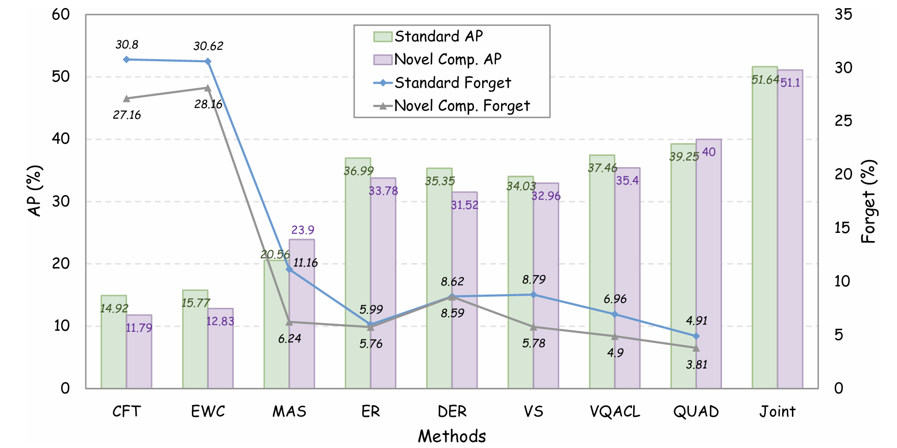

- **QUAD**: AP highest, Forget lowest (5.99%)
- **EWC/CFT**: Forget >27% — compositional reasoning collapses
- **Novel Composition**: unseen concept-relation pairs recombined at test time

---

<!-- _class: lead -->

# Part V: Cross-Survey Comparison

Combined Analysis & Future Directions

---

## Evolution of Continual Learning
### How the philosophy of "protecting knowledge" has shifted

~2021

Traditional CL

De Lange et al. (TPAMI)

ResNet from scratch · Vision only

<strong>Knowledge built from zero</strong> 
Weights themselves are the knowledge 
→ <strong>Lock weights</strong> (Isolation) 
→ <strong>Constrain weights</strong> (Regularization) 
PackNet, iCaRL, EWC

2022–2024

PTM-based CL

Zhou et al.

ViT pre-trained · Vision only

<strong>Knowledge inherited from PTM</strong> 
Feature space is already strong 
→ <strong>Minimize updates</strong> (Freeze + NCM) 
→ <strong>Preserve subspace</strong> (RanPAC) 
SimpleCIL, RanPAC, EASE

2024–

VLM-based CL

Liu et al.

CLIP, LLaVA · Vision + Language

<strong>Knowledge lives in cross-modal alignment</strong> 
Unimodal regularization breaks 
→ <strong>Preserve alignment</strong> (CREG) 
→ <strong>Hybrid adapters</strong> (PEA + Reg.) 
MoE-Adapters, O-LoRA, DKR

---

## Future Directions & Reflections

### Open Research Questions
- **CL for LLMs**: Lifelong model editing without full retraining
- **Embodied AI**: Continual multi-modal learning for robots with sensor fusion
- **Resource-constrained CL**: Edge/mobile deployment (CoDyRA: 4.4M vs 129.6M)
- **CoT Evaluation**: Micro-level reasoning diagnostics — accuracy alone is not enough

---

<!-- _class: lead -->
<!-- _paginate: false -->

# Thank You
## Questions?
